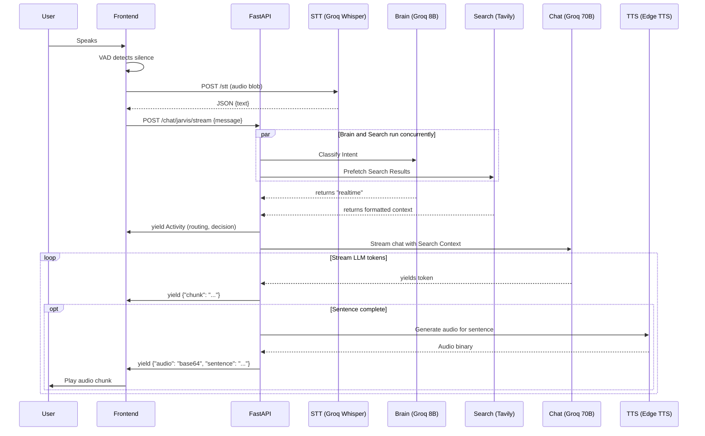

# AI_ENGINEER_CONTEXT

This document contains deep architectural and engineering details of J.A.R.V.I.S., intended specifically for an AI engineer or co-pilot to understand the codebase without needing to guess.

# 1. Dependency Graph

```text
main.py
├── config.py
├── app.models (ChatRequest, ChatResponse, TTSRequest)
├── app.services.vector_store (VectorStoreService)
├── app.services.groq_service (GroqService)
├── app.services.realtime_service (RealtimeGroqService)
├── app.services.chat_service (ChatService)
├── app.services.brain_service (BrainService)
├── app.services.task_executor (TaskExecutor)
├── app.services.vision_service (VisionService)
├── app.services.task_manager (TaskManager)
└── app.services.stt_service (STTService)

app/services/chat_service.py
├── config.py
├── app.models.ChatMessage
├── app.services.groq_service.GroqService
├── app.services.realtime_service.RealtimeGroqService
├── app.services.brain_service.BrainService
├── app.services.task_executor.TaskExecutor
├── app.services.vision_service.VisionService
├── app.services.task_manager.TaskManager
├── app.services.decision_types (HEAVY_INTENTS, INSTANT_INTENTS)
└── app.utils.key_rotation (get_next_key_pair)

app/services/brain_service.py
├── config.py (GROQ_API_KEYS, INTENT_CLASSIFY_MODEL)
└── langchain_groq.ChatGroq

app/services/task_executor.py
├── config.py (TASK_EXECUTION_TIMEOUT)
└── app.services.decision_types

app/services/realtime_service.py
├── tavily.TavilyClient
├── app.services.groq_service (GroqService, escape_curly_braces)
├── app.services.vector_store.VectorStoreService
├── app.utils.retry.with_retry
└── config.py

app/services/groq_service.py
├── config.py (GROQ_MODEL, GROQ_API_KEYS, etc.)
└── app.services.vector_store.VectorStoreService

app/services/stt_service.py
├── config.py (GROQ_API_KEYS)
└── groq.Groq
```

---

# 2. Entire API Flow

### `POST /chat/jarvis/stream` (Main Unified Route)
- **Request:** `{ "message": "...", "session_id": "...", "tts": true/false, "imgbase64": "..." }`
- **Functions:** `chat_jarvis_stream(request)` -> `chat_service.process_jarvis_message_stream()`
- **Services Called:**
  1. `BrainService.classify()` runs asynchronously to determine route.
  2. `RealtimeService.prefetch_web_search()` runs asynchronously concurrently with Brain.
  3. If Intent == `task`, `TaskManager.submit_task()` (for background) or `TaskExecutor.execute()` (for instant).
  4. If Intent == `vision`, `VisionService.analyze_image()`.
  5. `GroqService` or `RealtimeService` handles the conversational response stream.
  6. In `main.py` `_stream_generator()`, the text chunks are aggregated.
  7. `_tts_pool.submit(_generate_tts_sync)` executes TTS concurrently.
- **External APIs:** Groq API (8B intent, 70B chat), Tavily (Search), edge-tts (Speech).
- **Response:** Server-Sent Events (SSE). Streams `{"chunk": "..."}`, `{"audio": "base64", "sentence": "..."}`, `{"_activity": {...}}`, `{"actions": {...}}`.

### `POST /stt`
- **Request:** `multipart/form-data` with `file` (audio blob).
- **Functions:** `speech_to_text(file)` -> `stt_service.transcribe()`
- **Services Called:** `STTService`
- **External APIs:** `client.audio.transcriptions.create(model="whisper-large-v3-turbo")` on Groq API.
- **Response:** `{ "text": "...", "language": "en", "duration": 2.5, "error": null }`

### `POST /tts`
- **Request:** `{ "text": "Hello world" }`
- **Functions:** `text_to_speech(request)`
- **External APIs:** Microsoft Edge TTS (`edge_tts.Communicate.stream()`)
- **Response:** Chunked MP3 binary stream.

---

# 3. Function Map

### `app/services/chat_service.py`
- `get_or_create_session(session_id)`
  - **Purpose:** Loads chat from disk or memory, creates new UUID if none.
  - **Output:** `session_id` string.
- `process_jarvis_message_stream(session_id, user_message, imgbase64)`
  - **Purpose:** Master orchestrator. Runs brain + prefetch in ThreadPool. Yields SSE events.
  - **Inputs:** session string, user message string.
  - **Output:** Iterator of dicts/strings.
  - **Dependencies:** `BrainService`, `TaskExecutor`, `RealtimeService`, `GroqService`.

### `app/services/brain_service.py`
- `classify(user_message, chat_history)`
  - **Purpose:** Two-stage classification. Determines primary intent, then extracts tasks if applicable.
  - **Output:** Tuple `(category, task_types, combined_method, ms_elapsed)`.
- `_run_llm(...)`
  - **Purpose:** Calls Groq with system prompt.
  - **Output:** Raw string response from Llama 8B.

### `app/services/task_executor.py`
- `execute(intents, chat_history)`
  - **Purpose:** Takes structured intents, maps to worker functions, executes in ThreadPool.
  - **Output:** `TaskResponse` dataclass with accumulated URLs/images.
- `_generate_pollinations(prompt)`
  - **Purpose:** Synchronously downloads an image from Pollinations API.
  - **Output:** Tuple `(api_url, byte_content)`.

---

# 4. Brain Service Deep Dive

- **Prompts:** 
  - `_PRIMARY_BRAIN_PROMPT`: Rules strict classification into EXACTLY ONE of: `camera`, `task`, `mixed`, `realtime`, `general`. Instructs the model to check conversation history for context/corrections.
  - `_TASK_BRAIN_PROMPT`: Given a task, extracts structured `task_type query`. Valid types: `open`, `open_webcam`, `close_webcam`, `play`, `generate_image`, `content`, `google_search`, `youtube_search`.
- **Classification Logic:** Uses `langchain_groq.ChatGroq` bound to `llama-3.1-8b-instant`. It is extremely fast (~200ms).
- **Intent Categories:** 
  - `general`: Chit-chat, math, static facts.
  - `realtime`: Current events, news, live info requiring Tavily.
  - `camera`: Wants image analysis.
  - `task`: Action required (wopen, image generation).
  - `mixed`: Combines task + question.
- **Fallback Logic:** If LLM throws an exception (e.g. rate limit) or no API key, it falls back to `_rule_based_primary` and `_rule_based_task` which use hardcoded regex/substring matching (e.g. `if "who is" in msg -> realtime`).
- **Confidence Handling:** Handled organically by LLM. If LLM outputs garbage, `_parse_single` defaults to `general`.

---

# 5. Task Executor Deep Dive

Tasks are resolved into `intents` and executed concurrently in `ThreadPoolExecutor(max_workers=6)`.

- **`open` website:** Maps domain name via `SITE_MAP` dict, otherwise constructs `https://www.{query}.com`. Returns URL to frontend.
- **`play` (YouTube):** Returns `https://www.youtube.com/results?search_query={query}` to frontend.
- **`generate_image`:** Uses `https://image.pollinations.ai/prompt/{encoded_prompt}`. Blocks thread to download image bytes (`httpx.Client`), returns bytes and URL. Frontend receives Base64.
- **`content`:** Dispatches secondary call to `GroqService` to write an essay/code.
- **`google_search`:** Returns `https://www.google.com/search?q={query}`.
- **`youtube_search`:** Returns `https://www.youtube.com/results?search_query={query}`.
- **`open_webcam` / `close_webcam`:** Returns JSON action to frontend to manipulate DOM `<video>` tag.

---

# 6. Streaming Architecture

- **SSE (Server-Sent Events):** The endpoint returns a `StreamingResponse` with `media_type="text/event-stream"`.
- **Chunk Generation:** `GroqService.stream_response` loops over Langchain iterator yielding text chunks.
- **TTS Pipeline (Crucial):** Inside `main.py`'s `_stream_generator()`, the system intercepts text chunks. It uses regex `_SPLIT_RE` to aggregate chunks into full sentences. Once a sentence is complete, it submits the sentence to `_tts_pool` (ThreadPoolExecutor) which synchronously calls `edge-tts`. When the future completes, it yields an SSE event `{"audio": "b64...", "sentence": "..."}`.
- **Frontend Parser:** `script.js` uses native `fetch` + `ReadableStream` reader. It splits by `\n\n`, parses JSON. If `chunk` exists, updates DOM. If `audio` exists, pushes to `ttsPlayer.enqueue()`.

---

# 7. Frontend Event Flow

1. **User Click Mic:** `startListening()` in `script.js`.
2. **Mic Capture:** `navigator.mediaDevices.getUserMedia` captures stream. `MediaRecorder` buffers `audio/webm`.
3. **VAD (Voice Activity Detection):** `monitorVAD()` runs a `requestAnimationFrame` loop analyzing `analyser.getByteFrequencyData`.
4. **Silence Detected:** Stops recording. Blob is generated.
5. **STT:** `processSTT()` POSTs Blob to `/stt`. Receives transcribed text.
6. **Submit:** `sendMessage()` is called, pushing text to chat DOM.
7. **Stream:** `fetch()` to `/chat/jarvis/stream`.
8. **Render:** Text chunks progressively update the HTML element. Activities (`_activity`) trigger UI state changes (Activity panel, Orb colors).
9. **Audio:** As Base64 audio arrives, it's pushed to `TTSPlayer`. `TTSPlayer._playLoop()` converts Base64 back to Blob and plays sequentially via `<audio>` tag.

---

# 8. State Management (Frontend `script.js`)

- `sessionId` (String): UUID mapped to backend memory.
- `currentMode` (String): 'jarvis', 'general', 'realtime'.
- `isStreaming` (Bool): Locks UI while responding.
- `isListening` (Bool): Microphone state.
- `camStream` (Object): MediaStream of webcam.
- `autoListenMode` (Bool): If true, mic auto-restarts after TTS finishes.
- `ttsPlayer` (TTSPlayer instance): Manages audio queue and Web Audio API.

---

# 9. Prompts

1. **`_JARVIS_SYSTEM_PROMPT_BASE`** (`config.py`)
   - **Target:** Main Chat LLM (70B)
   - **Purpose:** Defines persona ("Sharp, warm, a little witty"), capabilities ("CAN DO", "CANNOT DO"), length constraint ("Reply SHORT by default").
2. **`GENERAL_CHAT_ADDENDUM`** (`config.py`)
   - **Target:** General Chat Service
   - **Purpose:** Forces LLM to rely strictly on context + internal knowledge, prohibiting "search online" cop-outs.
3. **`REALTIME_CHAT_ADDENDUM`** (`config.py`)
   - **Target:** Realtime Chat Service
   - **Purpose:** Forces LLM to use the injected Tavily search results as its primary source of truth, extracting specific dates/numbers.
4. **`QUERY_EXTRACTION_PROMPT`** (`realtime_service.py`)
   - **Target:** Fast LLM (8B)
   - **Purpose:** Compresses a conversational message (e.g., "tell me about him") into a clean keyword search (e.g., "Elon Musk news 2026").
5. **`_PRIMARY_BRAIN_PROMPT` & `_TASK_BRAIN_PROMPT`** (`brain_service.py`)
   - **Target:** Fast LLM (8B)
   - **Purpose:** Routing logic. Extracts actionable intents.

---

# 10. Current Bottlenecks

- **Rate Limits:** Groq has strict Tokens Per Minute limits. Even with `key_rotation.py`, bursting heavy traffic will crash the application.
- **Latency:** `_stream_generator` buffers text until a full sentence is formed before requesting TTS. This adds ~300-800ms of latency before the first word is spoken.
- **Single Points of Failure:** 
  - If Groq goes down, STT (Whisper), Brain, and Chat all fail.
  - If Pollinations.ai goes down, Image Generation hangs until timeout.
- **RAM/Storage:** FAISS vector store holds everything in memory on start-up. Growing `learning_data/` endlessly will eventually exhaust RAM or cause slow startups.

---

# 11. Architectural Debt

- **Monolithic API File:** `main.py` is >800 lines doing middleware, route definitions, inline TTS generator wrapping, and SSE formatting.
- **Frontend Monolith:** `script.js` is >1500 lines. Vanilla JS is hard to maintain for complex state interactions (VAD logic intertwined with DOM updates).
- **TTS Blocking:** ThreadPool TTS generation can block the text stream if Microsoft Edge API is slow, causing text rendering to stall artificially on the frontend.
- **Bypass Tokens:** Hacks like `CAM_BYPASS_TOKEN` ("TTCAMTOKENTT") used to secretly pass frontend camera state to the backend string.

---

# 12. Future Jarvis Suggestions

If scaling this into a "Tony Stark" level application:

1. **Agentic Framework:** Replace `BrainService` routing with an agentic framework (e.g., LangGraph). This allows tools to be called cyclically (Search -> Think -> Read Page -> Search again) rather than one-shot routing.
2. **Browser Automation:** `TaskExecutor` currently just opens URLs. Implement Playwright/Puppeteer so Jarvis can actually navigate the DOM and perform actions (e.g., booking tickets) in the background.
3. **Local LLM Fallback:** Integrate `Ollama` or `vLLM` to run an 8B model locally. If Groq rate limits, it falls back to the GPU, making the system indestructible.
4. **Frontend Rewrite:** Port `script.js` to React or Vue. Extract the AudioContext/VAD into a strict WebWorker to prevent main thread blocking during heavy DOM repaints.
5. **True Wake Word:** Instead of clicking the mic, implement Porcupine (Picovoice) for local offline wake-word detection ("Hey Jarvis").

---

# 13. Full Sequence Diagram


