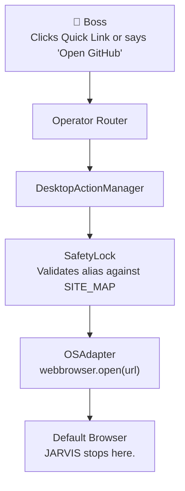

# Browser Actions — Capability 2

Browser Actions enables JARVIS to securely open trusted, whitelisted websites natively on the host machine using the default browser. 

**This is NOT automation. This is secure URL dispatch.**

## Core Principles
1. **Zero Browser Automation:** JARVIS cannot read browser content, click, scroll, fill forms, inspect the DOM, inject JavaScript, or remember browser history.
2. **Whitelist Only:** Only pre-approved domains are allowed. Arbitrary URLs are rejected by the SafetyLock.
3. **Alias Resolution:** Boss never sends raw URLs. Instead, Boss sends an alias (e.g., `github`) which the backend securely maps to a URL.
4. **Frequency Tracking:** JARVIS tracks the frequency of site aliases opened through the dashboard to surface the Most Used Sites.

## Architecture

## Security Guarantees
- No `Selenium`, `Playwright`, or `Puppeteer`.
- No raw URLs sent from the frontend.
- Hardcoded `SITE_MAP` acts as an absolute firewall.
- Uses `webbrowser` from Python's standard library.

## Dashboard Integration
- **Quick Links:** Dynamically populated from `QUICK_LINKS` backend config.
- **Most Used Sites:** Displays the top 3 most frequently opened sites.
