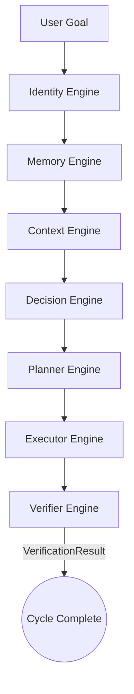

# Cognitive Pipeline

The **Cognitive Pipeline** connects all independent engines (organs) of JARVIS OS into a single, cohesive thinking loop. It represents the "main loop" of the system's cognition.

## Architecture

The pipeline processes user goals synchronously through each engine. Data passes sequentially, with each engine enriching the context.

## Execution Flow

## Data Flow & Dependencies
1. **Identity**: Adds current persona directives.
2. **Memory**: Injects historical context.
3. **Context**: Synthesizes Identity + Memory + Goal.
4. **Decision**: Consumes Context to output an `action`.
5. **Planner**: Consumes `action` to output `steps`.
6. **Executor**: Consumes `steps` to perform actions.
7. **Verifier**: Consumes executor state to determine success.

## Future Integrations
- In the future, the pipeline will break out of "Simulation Mode" and connect to the actual Groq-powered AI engines.
- Asynchronous task execution will be supported.
- The pipeline will handle self-triggering autonomous cycles.
