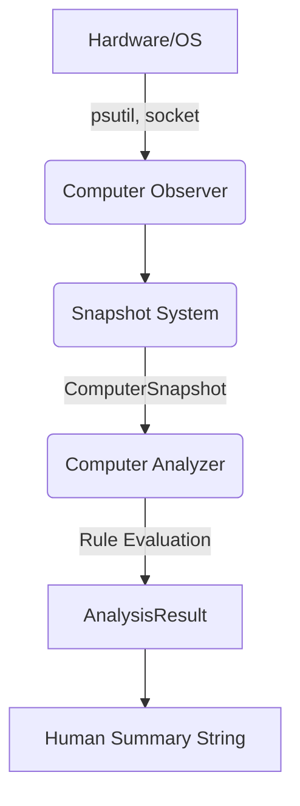

# Computer Awareness Layer

The Computer Awareness Layer grants JARVIS the fundamental ability to perceive the physical host machine without taking control of it. 

## Capabilities
- **System Information**: OS type, version, machine architecture, and system time.
- **Hardware Sensors**: Deep observation of CPU usage, Virtual Memory pressure, Disk storage capacity, Network connectivity, and Battery thresholds.
- **Process Activity**: Scans and parses the top running applications to evaluate multitasking density.

## Architecture

## Security Profile
- **OBSERVATION ONLY**: This module physically lacks the code to alter state.
- **Banned Vectors**: `subprocess`, `os.startfile`, `pyautogui`, `keyboard`, and `mouse` have been explicitly excluded from the import space.
- **Deterministic Bounds**: No LLMs are used to evaluate hardware states. The `ComputerAnalyzer` strictly uses hardcoded numerical thresholds to determine output strings.
