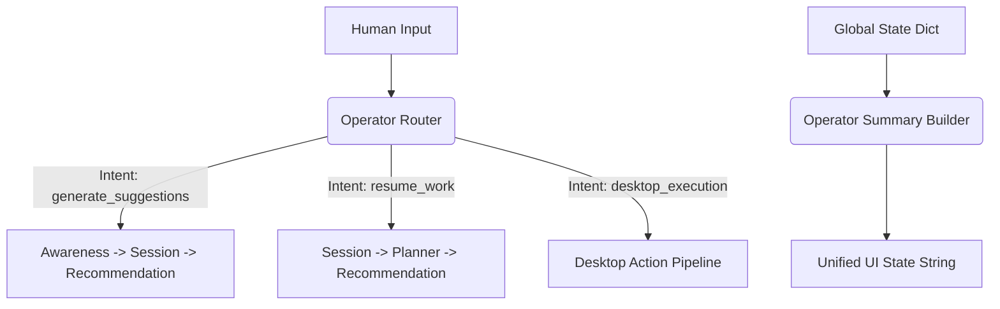

# Operator Engine

The Operator Engine (`jarvis_os/operator/`) functions as the central orchestrator for JARVIS OS. It replaces a monolithic "God model" with a strict switchboard that routes user intents exclusively to dedicated, isolated modules.

## Architecture

## Module Registry
The `operator_registry.py` tracks the health and availability of all modular subsystems:
- `identity`
- `memory`
- `awareness`
- `computer`
- `session`
- `decision`
- `planner`
- `recommendation`
- `desktop_action`

## Core Principle
The Operator **routes**. It does not **act**. All execution relies on the downstream safety locks of the target module.
