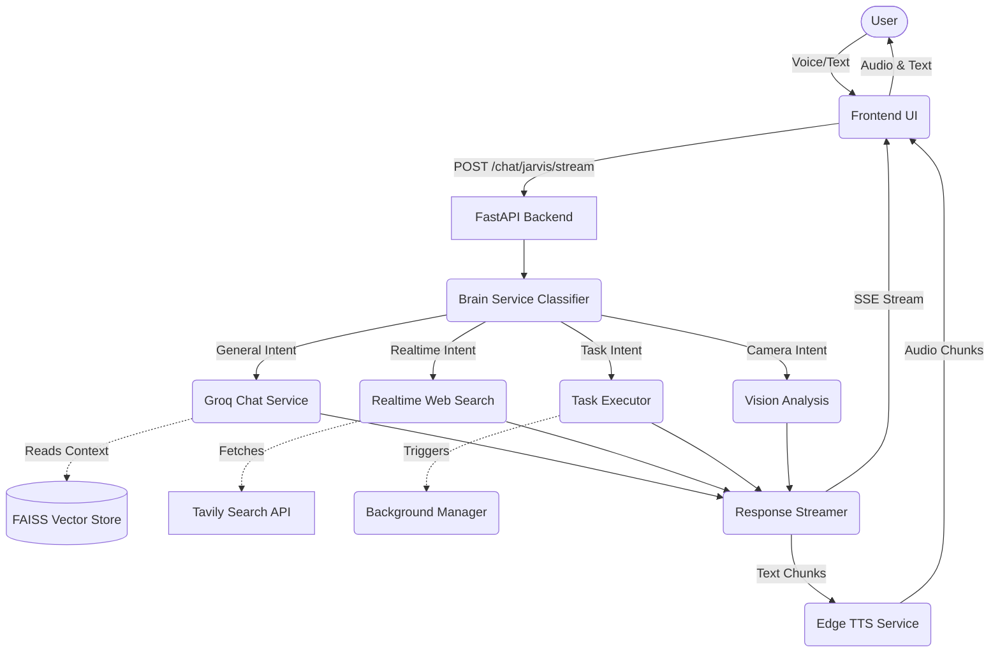

# PROJECT_CONTEXT

# 1. Project Overview

- **Project name:** J.A.R.V.I.S (Just A Rather Very Intelligent System)
- **Vision:** To create a highly intelligent, fully localized personal AI assistant with a beautiful web UI capable of reasoning, seeing, speaking, and executing tasks on behalf of the user.
- **End goal:** A connected ecosystem where J.A.R.V.I.S operates seamlessly across local machines, servers, and smart devices as a single intelligent brain.
- **Problem being solved:** The need for a fast, private, and versatile personal AI assistant that can act on real-time data, remember personal context, and perform web/system actions without relying entirely on paid SaaS ecosystems.
- **Current development stage:** Functional MVP / V1. Core capabilities like voice, vision, memory, web search, and task execution are implemented.
- **Short elevator pitch:** J.A.R.V.I.S is a fast, locally hosted AI assistant powered by Groq's Llama models. It features a three-mode chat system (General, Realtime, Jarvis), integrated STT/TTS, vision capabilities, and a dynamic frontend, all running from a single Python command.

# 2. Project Objectives

- **Voice assistant:** (Completed) Full Speech-to-Text (Groq Whisper) and Text-to-Speech (Microsoft Edge TTS).
- **Memory:** (Completed) Short-term context and long-term RAG-based memory using local `.txt` files and FAISS vector store.
- **Reasoning:** (Completed) Uses Llama 3.3 70B for deep reasoning.
- **Task execution:** (Completed) Can open apps/websites, play YouTube videos, and generate images.
- **Browser control:** (Planned/In Progress) Currently routes searches and opens URLs, but deeper browser DOM control is limited.
- **Vision:** (Completed) Uses Llama 4 Scout for analyzing webcam captures and uploaded images.
- **Automation:** (Completed) Asynchronous background task execution.
- **Multi-agent collaboration:** (Planned) Current architecture routes to different "services" (General, Realtime), acting as early-stage specialized agents.
- **Learning system:** (Completed) Auto-embeds `.txt` files dropped in `database/learning_data/` at startup.
- **Device control:** (In Progress) Currently controls webcam, but explicit smart home control is disabled in the system prompt.

# 3. High Level Architecture



**Layers explained:**
- **Frontend Layer:** Vanilla JS, HTML, CSS with a WebGL animated orb. Handles capturing voice/text and playing streaming audio and text.
- **Routing Layer (Brain):** A fast 8B model classifies the intent (general, realtime, task, camera).
- **Execution Layer:** Specialized services handle the intent.
- **Memory Layer:** FAISS with Sentence Transformers retrieves relevant past context.
- **Output Layer:** Edge TTS concurrently generates speech audio chunks while text is streamed back via Server-Sent Events (SSE).

# 4. Complete Folder Structure

```text
/jarvis
├── app/                       # Backend FastAPI application
│   ├── api/                   # API route definitions
│   ├── core/                  # Core application settings/lifespans
│   ├── db/                    # Database connection logic (if any)
│   ├── schemas/               # Pydantic models for API
│   ├── services/              # Core business logic (Agents/Tasks)
│   │   ├── brain_service.py   # Intent classifier
│   │   ├── chat_service.py    # Chat orchestration
│   │   ├── groq_service.py    # Llama chat integration
│   │   ├── realtime_service.py# Tavily web search integration
│   │   ├── stt_service.py     # Speech-to-text
│   │   ├── task_executor.py   # Task execution
│   │   ├── task_manager.py    # Background task handling
│   │   ├── vector_store.py    # FAISS vector store
│   │   └── vision_service.py  # Image analysis
│   ├── utils/                 # Helpers (retries, key rotation)
│   ├── main.py                # FastAPI app initialization
│   ├── models.py              # Request/Response models
│   └── generate_thinking_audio.py
├── database/                  # Local filesystem database
│   ├── camera_captures/       # Saved images from webcam
│   ├── chats_data/            # Chat history JSON files
│   ├── learning_data/         # User's personal .txt files for RAG
│   └── vector_store/          # Compiled FAISS index files
├── frontend/                  # Web UI
│   ├── assets/                # Static assets
│   ├── audio/                 # Sound effects
│   ├── css/                   # Stylesheets
│   ├── images/                # Images/icons
│   ├── js/                    # JavaScript modules
│   ├── index.html             # Main chat interface
│   ├── viewer.html            # Alternative viewer
│   ├── style.css              # Main stylesheet
│   ├── script.js              # Frontend logic
│   └── orb.js                 # WebGL Orb visualization
├── jarvis plan/               # Project documentation and notes
│   ├── ANALYSIS.md            
│   └── jarvis_plan.md         
├── .env                       # Environment variables (Secrets)
├── config.py                  # Environment config loader and system prompts
├── requirements.txt           # Python dependencies
├── run.py                     # Entry point script
└── start_server.bat           # Windows startup script
```

# 5. Tech Stack

- **Frontend:** Vanilla HTML/CSS/JS. Chosen for simplicity and direct control over streaming and DOM manipulation without framework overhead. WebGL (GLSL) used for the animated orb.
- **Backend:** FastAPI (Python). Chosen for high-performance async capabilities, crucial for streaming SSE and concurrent TTS generation.
- **LLM Provider:** Groq. Used for ultra-fast inference (Llama 3.3 70B for chat, 8B for brain, Llama 4 Scout for vision).
- **Web Search:** Tavily API. Optimized for LLM RAG applications.
- **Image Generation:** Pollinations.ai. Used because it requires no API key and is free.
- **Database (Memory):** FAISS (Facebook AI Similarity Search) + HuggingFace `sentence-transformers/all-MiniLM-L6-v2`. Chosen for fast, local, offline vector embeddings.
- **Speech-to-Text:** Groq Whisper. Fast transcription.
- **Text-to-Speech:** `edge-tts`. Microsoft Edge's TTS API, chosen because it is free and produces high-quality neural voices.

# 6. Execution Flow

**Scenario: User says "Jarvis open YouTube and play Arijit Singh songs."**

1. **Input:** User speaks into the microphone on the frontend.
2. **STT:** Frontend sends audio to `/stt`. Groq Whisper transcribes it to text.
3. **Submission:** Frontend sends the text to `POST /chat/jarvis/stream`.
4. **Classification (BrainService):** 
   - Primary prompt classifies intent as `mixed` or `task`.
   - Task classification extracts two tasks: `["open", "play"]` with queries `open youtube`, `play Arijit Singh songs`.
5. **Execution (TaskExecutor):**
   - Resolves `open youtube` to `https://www.youtube.com`.
   - Triggers frontend action to open the URL.
   - Extracts `Arijit Singh songs` as a YouTube search query.
   - Triggers frontend action to play the video.
6. **Response Generation:** LLM generates a brief confirmation like "Opening YouTube and playing Arijit Singh."
7. **TTS Generation:** `edge-tts` starts generating audio chunks for the response.
8. **Streaming:** Text and Base64 encoded audio are streamed back to the frontend via Server-Sent Events.
9. **Frontend Playback:** Frontend displays the text and auto-plays the audio sequentially.

# 7. Frontend Analysis

- **Framework:** Vanilla JavaScript, HTML5, CSS3. No build step (Webpack/Vite).
- **Pages:** `index.html` (main chat), `viewer.html`.
- **Components:** 
  - `orb.js`: Handles the WebGL animated orb that reacts to system states.
  - Chat Area: Displays message history.
  - Camera Panel: Live webcam feed for vision tasks.
  - Activity Panel: Displays backend background task flows.
- **State management:** Managed via DOM elements and global variables in `script.js`.
- **Data flow:** Uses Fetch API with `ReadableStream` to process Server-Sent Events line by line.

# 8. Backend Analysis

- **Server structure:** FastAPI application instantiated in `app/main.py`.
- **Routes:** 
  - `/chat`, `/chat/stream`: General queries.
  - `/chat/realtime`, `/chat/realtime/stream`: Web search queries.
  - `/chat/jarvis/stream`: The main unified route utilizing the Brain.
  - `/tts`, `/stt`: Speech processing endpoints.
- **Services:** Heavy use of service classes (`ChatService`, `BrainService`, etc.) injected with dependencies.
- **Queue Systems:** Uses `concurrent.futures.ThreadPoolExecutor` for running synchronous TTS tasks and background task polling.

# 9. Database Analysis

- **Database type:** Local File System and FAISS.
- **Schemas:** 
  - `chats_data/`: JSON arrays containing `{"role": "user/assistant", "content": "..."}`.
  - `learning_data/`: Plain text files containing personal facts.
- **Relationships:** None, flat structure.
- **Purpose:** 100% local privacy. No reliance on external database providers.

# 10. AI/Agent Architecture

1. **Brain Agent**
   - Responsibility: Classify intent and extract task payloads.
   - Inputs: User message, Chat history.
   - Outputs: Intent category, clean task queries.
2. **General Agent (GroqService)**
   - Responsibility: Conversational QA.
   - Inputs: User message, Vector store context.
   - Outputs: Text response.
3. **Realtime Agent (RealtimeService)**
   - Responsibility: Current events.
   - Inputs: Cleaned search query.
   - Outputs: Text response augmented by Tavily search results.
4. **Vision Agent (VisionService)**
   - Responsibility: Image analysis.
   - Inputs: Base64 Image, User prompt.
   - Outputs: Image description/answer.

Agents communicate synchronously through the `ChatService` orchestrator, which invokes them based on the `BrainService`'s decision.

# 11. Memory System

- **Short term memory:** `ChatService` maintains session state in memory and dumps to `chats_data/session_id.json`. Context limit enforced via `MAX_CHAT_HISTORY_TURNS = 10`.
- **Long term memory:** `learning_data/` text files are chunked (`CHUNK_SIZE = 1000`) and embedded via `sentence-transformers` into a local FAISS index on server startup.
- **Retrieval mechanisms:** Semantic similarity search fetches top 5 most relevant chunks and injects them into the system prompt.

# 12. Voice System

- **Speech To Text:** Groq Whisper model via API. Handles multiple languages automatically.
- **Text To Speech:** Microsoft `edge-tts` python library.
- **Wake word:** Not explicitly coded in the backend. Handled manually via frontend mic button click.
- **Audio pipeline:** Backend generates chunked MP3 buffers and streams them as Base64 JSON payloads over SSE to the frontend `AudioContext`.

# 13. Vision System

- **Screen understanding:** Can capture images from the webcam via the frontend `<video>` element.
- **Image analysis:** Sent as Base64 payload to Groq's `llama-4-scout-17b-16e-instruct` model.
- **Camera integration:** Dedicated frontend UI panel allows continuous camera streaming, capturing a frame on demand.

# 14. Automation System

- **Task execution:** Handled by `TaskExecutor`. Parses specific intents and executes them.
- **Browser control:** Uses URL resolution to generate "open" commands for the frontend.
- **Background jobs:** Handled by `TaskManager`.

# 15. APIs & External Services

- **Groq API:** Fast LLM Inference. Endpoint: `api.groq.com`. Auth: Bearer Token.
- **Tavily API:** Real-time web search. Endpoint: `api.tavily.com`. Auth: API Key.
- **Pollinations.ai:** Image generation. Endpoint: `image.pollinations.ai/prompt/{query}`. Auth: None.

# 16. Environment Variables

- `GROQ_API_KEY`: Primary key for Groq models.
- `GROQ_API_KEY_2`, `_3`, etc.: Automatic fallback keys for rate limit handling.
- `TAVILY_API_KEY`: Key for web search.
- `GROQ_MODEL`: Default chat model (`llama-3.3-70b-versatile`).
- `ASSISTANT_NAME`: "Jarvis".
- `JARVIS_USER_TITLE`: E.g., "Sir".
- `JARVIS_OWNER_NAME`: User's name for context.
- `TTS_VOICE`: `en-GB-RyanNeural`.
- `TTS_RATE`: Speech speed modifier (`+22%`).

# 17. Dependencies

- **Web:** `fastapi`, `uvicorn`, `starlette`
- **AI/LLM:** `langchain`, `langchain-groq`
- **Memory:** `faiss-cpu`, `sentence-transformers`, `numpy`
- **Voice:** `edge-tts`
- **Config:** `python-dotenv`

# 18. Current Working Features

- Real-time SSE streaming of text and audio.
- Intent classification (Brain).
- Web searching via Tavily.
- Image generation via Pollinations.ai.
- Local document embedding and retrieval (Memory).
- Voice I/O (STT & TTS).
- Webcam integration.

# 19. Broken Features

- **Rate Limiting Handling:** Groq rate limits can still cause abrupt failures if all fallback keys are exhausted.
- **Impact:** System stops responding.
- **Suggested Fix:** Implement token tracking and wait queues.

# 20. Pending TODOs

- Codebase is remarkably clean of explicit `TODO:` comments.
- Implicit TODOs from `jarvis_plan.md`:
  - Smart device control / connected ecosystem spanning local machines and servers.

# 21. Development Roadmap

- **Current phase:** V1 Desktop/Local Web Assistant.
- **Next phase:** Deep OS integration and true browser DOM automation (beyond opening URLs).
- **Future phase:** Distributed "Connected Ecosystem" allowing J.A.R.V.I.S to manage smart devices and robots.

# 22. Deployment Architecture

- **Local setup:** Clone repo, setup `.env`, install `requirements.txt`, run `python run.py`.
- **Production setup:** Not designed for public multi-tenant production. It is a single-user local application.
- **Hosting providers:** Localhost.
- **Docker/CI-CD:** Not currently implemented.

# 23. Git Analysis

- **Major milestones:** Initial Commit.
- **Recent changes:** Merge branch 'main' of GitHub repo. Vinit Jangir appears to be the primary developer.

# 24. Important Files

1. **Path:** `app/main.py`
   - **Purpose:** FastAPI entry point, SSE generator, and request router.
   - **Importance:** High. Connects all services together.
2. **Path:** `app/services/brain_service.py`
   - **Purpose:** Two-stage intent classification.
   - **Importance:** Critical. Determines how every single message is handled.
3. **Path:** `frontend/script.js`
   - **Purpose:** Handles SSE parsing, audio queueing, and UI state.
   - **Importance:** High. The entire user experience relies on this client script.

# 25. Things Another AI Engineer Must Know

**"Read this first before touching the code"**

- **Project conventions:** The backend uses strict Dependency Injection (services are instantiated in `main.py` and passed to each other). Do not instantiate services inside other services.
- **Architecture:** The "Brain" does NOT answer questions. It only classifies intents (`general`, `realtime`, `task`, `camera`, `mixed`). Do not modify the Brain to return conversational answers.
- **Audio Streaming:** TTS is generated concurrently in chunks and sent via Base64 JSON over SSE to avoid blocking the text stream. Be extremely careful when touching `_stream_generator` in `main.py`.
- **Fallback Keys:** Groq rate limits aggressively. The system uses a rotating key system (`GROQ_API_KEY`, `GROQ_API_KEY_2`, etc.). Always ensure you use the wrapper for requests.
- **Frontend:** No React/Vue. Vanilla JS. Modifying DOM requires understanding the current state machine in `script.js`.

# 26. Project Health Score

- **Architecture:** 8/10 (Clean service layer, but `main.py` is quite large).
- **Code Quality:** 8/10 (Good modularity, explicit typing in services).
- **Scalability:** 5/10 (Designed as a local single-user system; not horizontally scalable).
- **Security:** 7/10 (Local only, so low risk. FAISS handles files securely).
- **Maintainability:** 8/10 (No complex build steps, Python/FastAPI is standard).
- **Documentation:** 9/10 (Extensive README and design docs).

# 27. Executive Summary

J.A.R.V.I.S is a fast, highly capable, locally hosted AI assistant built on Python (FastAPI) and Vanilla JS. It leverages Groq's high-speed Llama models for immediate inference. Its core innovation is a "Brain" router that intercepts user inputs and decides whether to use a local RAG memory, perform a real-time web search, analyze a camera feed, or execute a browser task. With built-in text-to-speech that streams audio chunks back to a WebGL-powered frontend, it offers an incredibly immersive, zero-latency user experience. It is designed for single-user local deployment and represents a robust MVP for a personal AI co-pilot.
