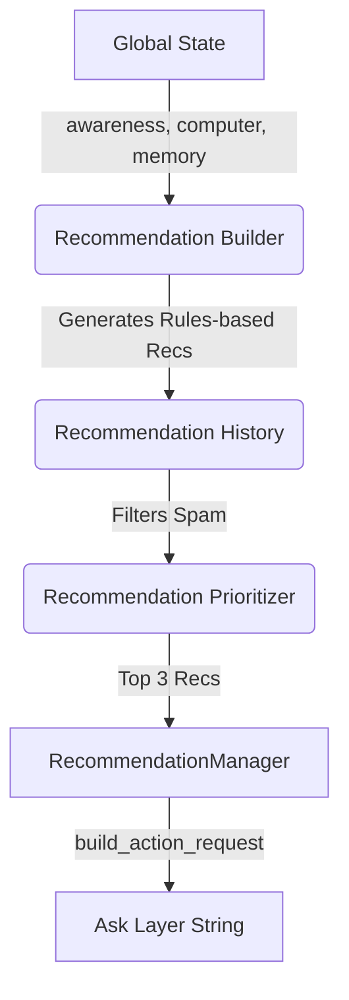

# Recommendation Layer

The Recommendation Layer shifts JARVIS from a purely reactive chatbot into a proactive virtual assistant. However, it maintains absolute safety by adhering to the foundational rule: **Recommendation before action.**

## Architecture

## How It Works
Instead of reading a high-memory state and blindly killing processes, JARVIS observes the state, maps it to the deterministic `RecommendationBuilder`, checks if he has recently suggested a fix via `RecommendationHistory`, and finally outputs a natural language request via the "Ask Layer".

**Example Output:**
*"I recommend closing unused applications. Reason: System memory is critically high. Proceed?"*
