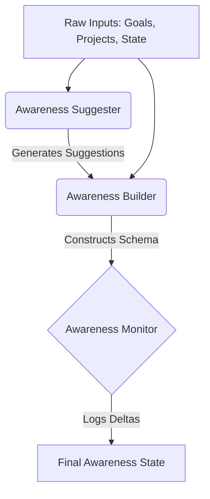

# JARVIS OS - Self Awareness Layer

The **Self Awareness Layer** represents the final intelligence phase of the JARVIS OS architecture before the transition to operational abilities (like Desktop Control). It grants JARVIS the introspective capability to understand "Who is Boss?" and "What is happening right now?".

## Architecture

The layer is broken down into three operational sub-modules orchestrated by a central manager.

1. **Awareness Builder**: Aggregates disparate data arrays into a single coherent structure defining exactly what is active, what is pending, and what is urgent.
2. **Awareness Suggester**: A strictly deterministic (No AI) rules engine designed to flag actionable moments (e.g., suggesting preparation for a looming interview or enforcing silence during coding).
3. **Awareness Monitor**: A passive observer evaluating temporal deltas in projects, goals, and priorities to trigger logs without executing arbitrary behavior.

## Data Flow

## Future Compatibility

This layer is specifically structured to feed directly into the Context and Decision engines constructed in earlier sprints. When JARVIS acquires active "Abilities", the Self Awareness Layer will dictate *when* to use them (e.g., "Do not interrupt Boss during a coding session"). It operates purely deterministically to ensure AI hallucination does not override user preferences.
