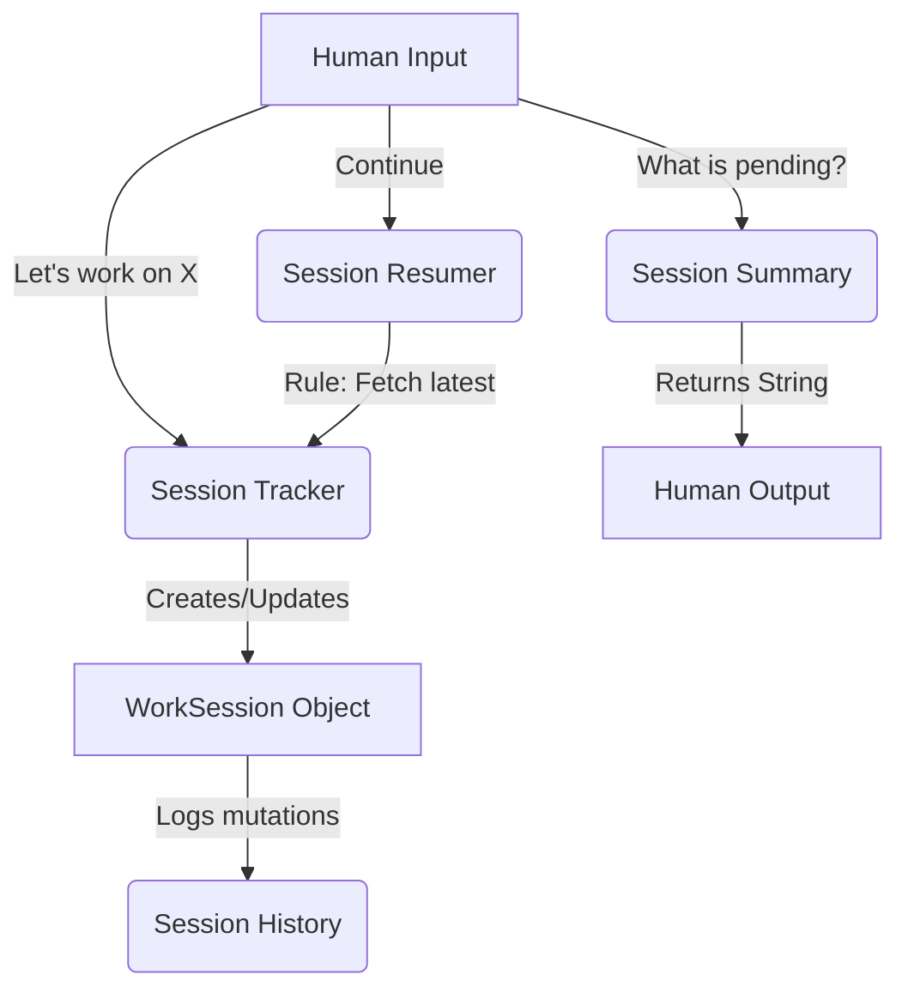

# Session Intelligence Engine

The Session Intelligence Engine (`jarvis_os/session/`) grants JARVIS the ability to contextualize time and continuity. Rather than starting every conversation blank, JARVIS can map human intent to an ongoing JSON data structure representing a "Work Session."

## Architecture

## Daily Usage Examples
- **Starting**: "Let's work on Jarvis. Focus is on Runtime Integration." -> The tracker creates a new `WorkSession` and sets it as active.
- **Updating**: "Add 'Browser awareness' to the pending list." -> The tracker updates the array.
- **Resuming**: "Resume yesterday's work." -> The resumer scans the tracked sessions, filters by date, and restores the active ID.
