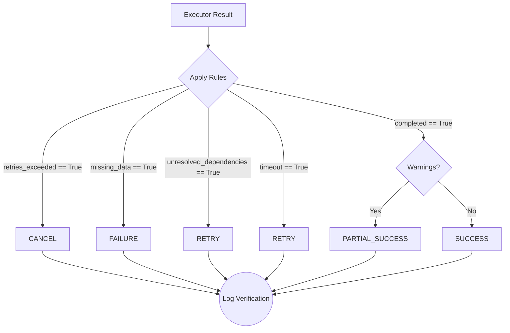

# Verifier Engine

The **Verifier Engine** is the final component of the JARVIS OS Cognitive Pipeline. Its sole responsibility is to evaluate the output of the Executor Engine and deterministically decide the ultimate success, failure, or retry status of the cognitive cycle.

## Architecture & Responsibilities
- **Input**: The planned action, the executor's result, and the original decision context.
- **Output**: A `VerificationResult` indicating `success`, `partial_success`, `failure`, `retry`, or `cancel`.
- **Rules Engine**: Operates purely on deterministic rules—NO AI or LLM evaluation is used at this stage.

## Execution Flow

## Future Integrations
- Can be expanded with complex, non-AI programmatic rules based on system logs, return codes, and database states.
- Can connect back to the Context Engine to provide feedback loops for future decisions.
