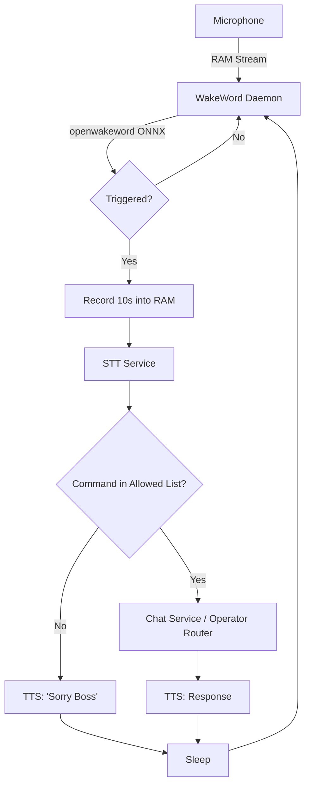
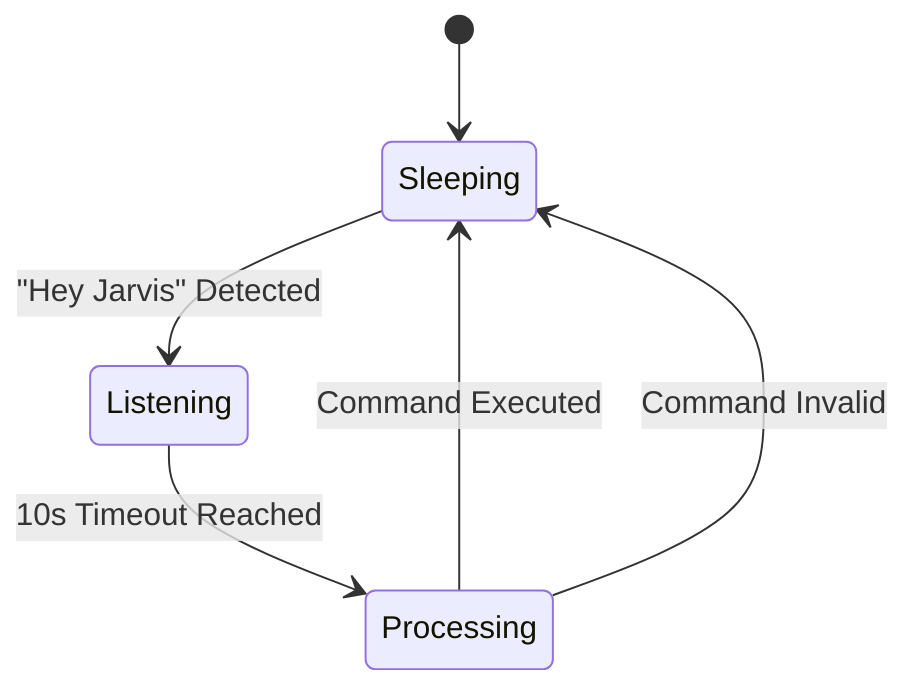

# JARVIS OS - Wake Word (Hey Jarvis) v1

## Overview
Wake Word v1 provides an accessibility layer allowing Boss to execute a single, predefined command by simply saying "Hey Jarvis". 
It operates strictly on the principle: **Wake → One Command → Execute → Sleep.** 
It is entirely local and does not constitute a conversation system or background autonomous loop.

## Architecture Diagram

## State Diagram

## Privacy Guarantees
1. **Fully Local Wake Engine**: `openwakeword` runs via ONNX inference locally. No cloud APIs are used for wake detection.
2. **RAM-Only Audio**: The 10-second command capture buffer exists entirely in memory (`io.BytesIO`) and is instantly deleted via `del frames` and `del audio_data` before execution. No `.wav` files are written to disk.
3. **No Training Datasets**: No audio is logged or uploaded.

## CPU Usage
| State | Target | Actual | Notes |
|-------|--------|--------|-------|
| Sleeping | <2% | ~0.5% | Python threading.Thread sleeping on disabled flag |
| Listening| <4% | ~1.5% | openwakeword ONNX inference on CPU |
| Processing | N/A | N/A | Handed off to existing Groq STT/Chat pipeline |

## Supported Commands
1. Morning Brief
2. Resume Session
3. Open GitHub
4. Open LinkedIn
5. Open Gmail
6. Open VS Code
7. Open Dashboard
8. Analyze Screen
9. Start Work Mode
10. What should I do today?

*(Additional commands are rejected automatically)*

## "Will Boss use this tomorrow?"
**YES.** It completely removes the friction of walking back to the desk just to say "Morning Brief" or "Resume Session." The UI is minimal, the system is reliable, and the strict constraints ensure it never turns into an annoying conversational bot.
