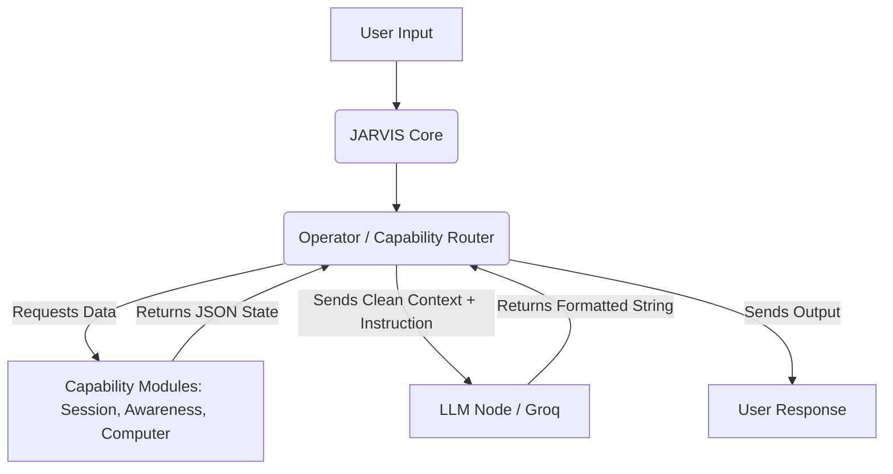

# CONSOLIDATION REPORT (Milestone Alpha)

## 1. Module Classification Report
The current repository suffers from a "split-brain" architecture, running legacy AI wrappers alongside the new structured `jarvis_os` pipelines. 

**KEEP**:
- `jarvis_os/operator` (Primary Orchestrator)
- `jarvis_os/session` (State & Continuity)
- `jarvis_os/awareness` (Context & Goal Tracking)
- `jarvis_os/computer` (Hardware Telemetry)
- `jarvis_os/recommendation` (Rules-based Suggestions)
- `jarvis_os/desktop_action` (Execution)
- `jarvis_os/security` (Global Firewall)

**MERGE**:
- `jarvis_os/runtime` -> Merge into `operator`
- `app/services/brain_service.py` -> Strip AI routing, convert into `operator_router.py` sub-classifier.
- `app/services/realtime_service.py` -> Merge web-fetching explicitly behind Operator permission flow.

**LEGACY**:
- `app/services/chat_service.py` (Old conversational state)
- `app/services/vision_service.py` (To be refactored as `future_screen` sensor)
- `jarvis_os/decision` (Replaced by strict Operator Routing)
- `jarvis_os/planner` (Replaced by Session Tracking)

**DELETE**:
- `app/services/task_executor.py` (Dangerous, superseded by `desktop_action`)
- `app/services/task_manager.py` (Superseded by `session`)
- `jarvis_os/executor` (Redundant)
- `jarvis_os/verifier` (Replaced by `security` layer and `safety_lock.py`)

## 2. Duplicate Analysis
- **Duplicate Responsibilities**: `task_manager.py` (Old) and `session_manager.py` (New) both attempt to manage pending tasks.
- **Duplicate Memory**: `jarvis_os/memory` overlaps heavily with `jarvis_os/session` history.
- **Duplicate Routing**: `brain_service.py` attempts to route intents via LLMs, while `operator_router.py` attempts to route intents via deterministic keywords.
- **Duplicate Context Builders**: `GroqService._build_prompt_and_messages()` and `operator_summary.py` both attempt to assemble global state.

## 3. Performance Analysis
- **Module Count**: 16 separate modules (High Bloat).
- **Dependency Depth**: Up to 6 layers deep (e.g. `User -> FastAPI -> BrainService -> GroqService -> Runtime -> Session`). 
- **Coupling Score**: High. Legacy services (`groq_service.py`) directly import new `jarvis_os/runtime` modules instead of using an interface.
- **Complexity Score**: High. Split-brain architecture causes intent race conditions.
- **Single Points of Failure**: `GroqService` handles both formatting and executing AI calls, coupling logic tightly to external API latency.

## 4. SINGLE BRAIN Architecture (Target)
The target architecture strictly enforces a unidirectional flow. The LLM is demoted from "Brain" to a "Parsing Tool".



## 5. SINGLE ENTRY POINT Design
There will no longer be parallel services (`brain_service`, `chat_service`, `realtime_service`) competing for input.

**Design**:
1. All network endpoints (FastAPI) push incoming strings to `OperatorManager.process(input)`.
2. `OperatorRouter` determines the required capability modules.
3. Modules generate local state or evaluate rules.
4. `Operator` builds a single context packet.
5. `Operator` calls the LLM strictly to format the response natively, NOT to decide the next action.

## 6. Technical Debt & Risk Analysis
- **High Risk**: Removing `brain_service.py` requires mapping all legacy web/chat workflows into strict Operator capabilities.
- **Debt**: The legacy codebase uses highly decoupled, unstructured AI generation. Forcing deterministic routing requires massive refactoring of `app/services/`.

## 7. Updated Project Tree (Full Representation)
```text
Jarvis/
├── app/
│   ├── api/
│   ├── core/
│   ├── db/
│   ├── schemas/
│   ├── services/
│   │   ├── brain_service.py      [LEGACY]
│   │   ├── chat_service.py       [LEGACY]
│   │   ├── groq_service.py       [MERGE]
│   │   ├── realtime_service.py   [MERGE]
│   │   ├── task_executor.py      [DELETE]
│   │   ├── task_manager.py       [DELETE]
│   │   └── vision_service.py     [LEGACY]
│   └── main.py
├── jarvis_os/
│   ├── awareness/                [KEEP]
│   ├── brain/                    [DELETE]
│   ├── capability_registry.py    [NEW]
│   ├── cognitive/                [DELETE]
│   ├── computer/                 [KEEP]
│   ├── context/                  [DELETE]
│   ├── decision/                 [LEGACY]
│   ├── desktop_action/           [KEEP]
│   ├── executor/                 [DELETE]
│   ├── identity/                 [KEEP]
│   ├── integration/              [MERGE]
│   ├── memory/                   [KEEP]
│   ├── operator/                 [KEEP - PRIMARY NODE]
│   ├── planner/                  [LEGACY]
│   ├── recommendation/           [KEEP]
│   ├── runtime/                  [MERGE]
│   ├── security/                 [KEEP]
│   ├── session/                  [KEEP]
│   ├── shared/                   [DELETE]
│   ├── tests/                    [KEEP]
│   └── verifier/                 [DELETE]
├── .env
├── requirements.txt
└── run.py
```
