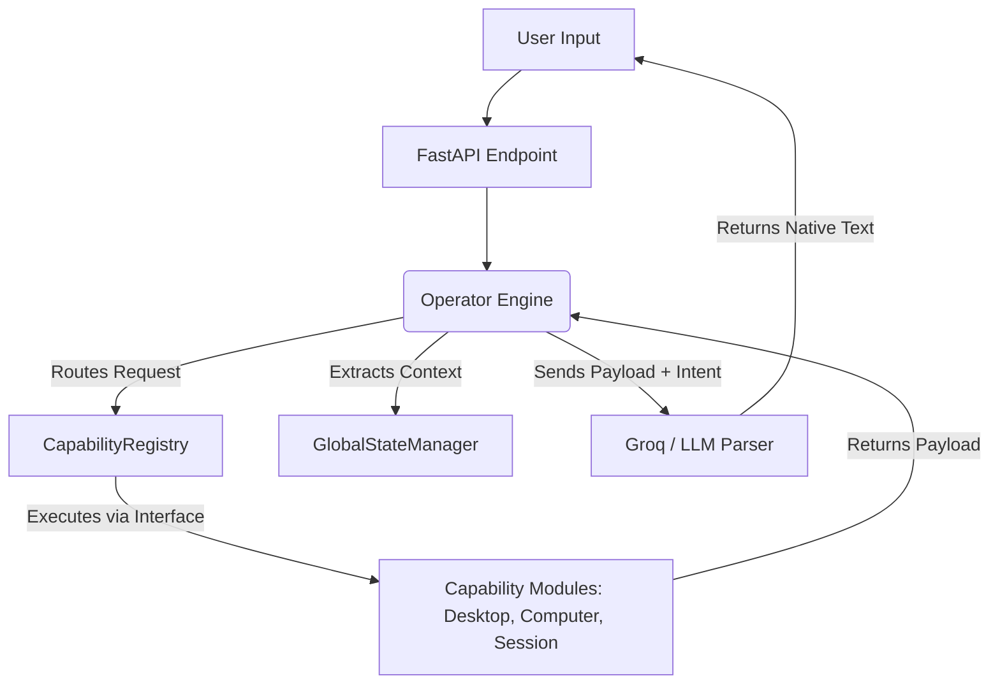

# REAL CONSOLIDATION REPORT (Milestone Beta)

## Current Architecture
The repository still technically hosts the "Original JARVIS" (`app/services`) alongside `jarvis_os`. We have successfully mapped the states of all modules into ACTIVE, DEPRECATED, and LEGACY states, but imports remain scattered.

## Target Architecture (Single Entry Point)

## Migration Path
1. **Enforce Interfaces**: Map all **ACTIVE** modules (`session`, `awareness`, `desktop_action`) to inherit and implement `CapabilityInterface`.
2. **Re-route Entry Points**: Update `main.py` (FastAPI) to bypass `brain_service.py` entirely and push endpoints exclusively to `OperatorManager`.
3. **Quarantine Legacy Code**: Move all **LEGACY** and **DEPRECATED** modules out of the execution path. (Note: we are currently forbidden from deleting code).

## Risk Analysis
- **Execution Failure**: If `desktop_action` fails to implement the strict `execute(payload)` schema of the `CapabilityInterface`, the entire OS execution flow will crash.
- **LLM Context Starvation**: If the `GlobalStateManager` is not properly populated by the modules, the LLM will hallucinate states because it lacks historical prompts.

## Timeline
This consolidation serves as the final step of the architectural phase. The actual physical wire-up of `main.py` -> `Operator` will represent the beginning of the Production Phase.
