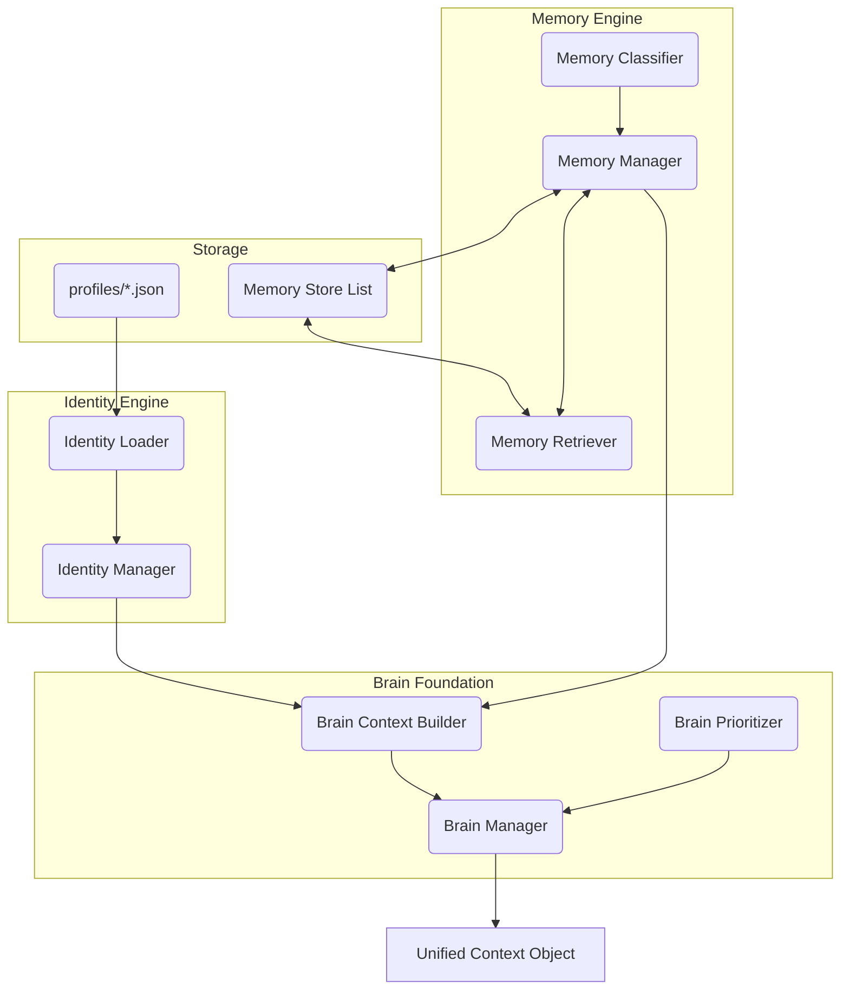

# Week 1 Part 2 - Identity, Memory, and Brain Foundation

## Executive Summary
This sprint established the core cognitive organs of Jarvis OS: the Identity Engine, the Memory Engine, and the Brain Foundation. By explicitly separating these concerns, we have transitioned Jarvis from a stateless text-responder into an entity capable of deeply understanding the user's goals, preferences, and history. All modifications were strictly foundational; no existing APIs, frontend logic, or streaming mechanisms were touched.

## Files Created

### Shared Layer (Dependency Injection Core)
* `jarvis_os/shared/constants.py`
* `jarvis_os/shared/enums.py`
* `jarvis_os/shared/types.py`
* `jarvis_os/shared/README.md`

### Identity Engine
* `jarvis_os/identity/identity_manager.py` (Exposes `get_identity_context()`)
* `jarvis_os/identity/identity_models.py` (Pydantic validation schemas)
* `jarvis_os/identity/identity_loader.py` (JSON ingestor)
* `jarvis_os/identity/README.md`

### Memory Engine
* `jarvis_os/memory/memory_manager.py`
* `jarvis_os/memory/memory_models.py` (Defines `MemoryItem` with UUID and timestamps)
* `jarvis_os/memory/memory_store.py` (State holding)
* `jarvis_os/memory/memory_retriever.py` (Sorting and filtering)
* `jarvis_os/memory/memory_classifier.py` (Rules-based importance scoring)
* `jarvis_os/memory/README.md`

### Brain Foundation
* `jarvis_os/brain/brain_manager.py`
* `jarvis_os/brain/brain_context_builder.py` (Exposes `build_brain_context()`)
* `jarvis_os/brain/brain_prioritizer.py`
* `jarvis_os/brain/README.md`

### Documentation
* `IDENTITY_ENGINE.md`
* `MEMORY_ENGINE.md`
* `BRAIN_FOUNDATION.md`
* `WEEK1_PART2_REPORT.md`

## Architecture Flow

## Data Flow
1. **Startup**: `IdentityLoader` reads the JSON templates created in Part 1 and uses Pydantic schemas in `identity_models.py` to structure the data.
2. **Runtime Memory**: New data runs through `MemoryClassifier` to receive an `ImportanceLevel` (e.g., "Critical", "Low") before being appended to the `MemoryStore`.
3. **Context Construction**: When an action occurs, the `BrainContextBuilder` pulls `get_identity_context()` and `get_recent_memories()`, merging them into a single comprehensive dictionary representing the current "State of the Boss".

## Compatibility Notes
* Strict separation was maintained. The `jarvis_os` package currently exists entirely parallel to the `app/` FastApi codebase.
* No LLM APIs (Groq) or web search APIs (Tavily) have been wired to the new modules, preserving existing API limits and ensuring zero breakage.

## Future Expansion Notes
* **Memory AI Upgrade**: The `MemoryClassifier` is currently rules-based. In Phase 3, this will be upgraded to an LLM-driven classifier that determines importance based on contextual nuance.
* **FAISS Re-Integration**: The `MemoryStore` list will be bound to the existing FAISS local vector database to allow for semantic querying of thousands of past memories.
* **Brain Loop**: The Brain will be connected to the `Planner` in upcoming sprints, allowing it to take the `Unified Context Object` and autonomously decide if it should generate a background task or wait for user input.
