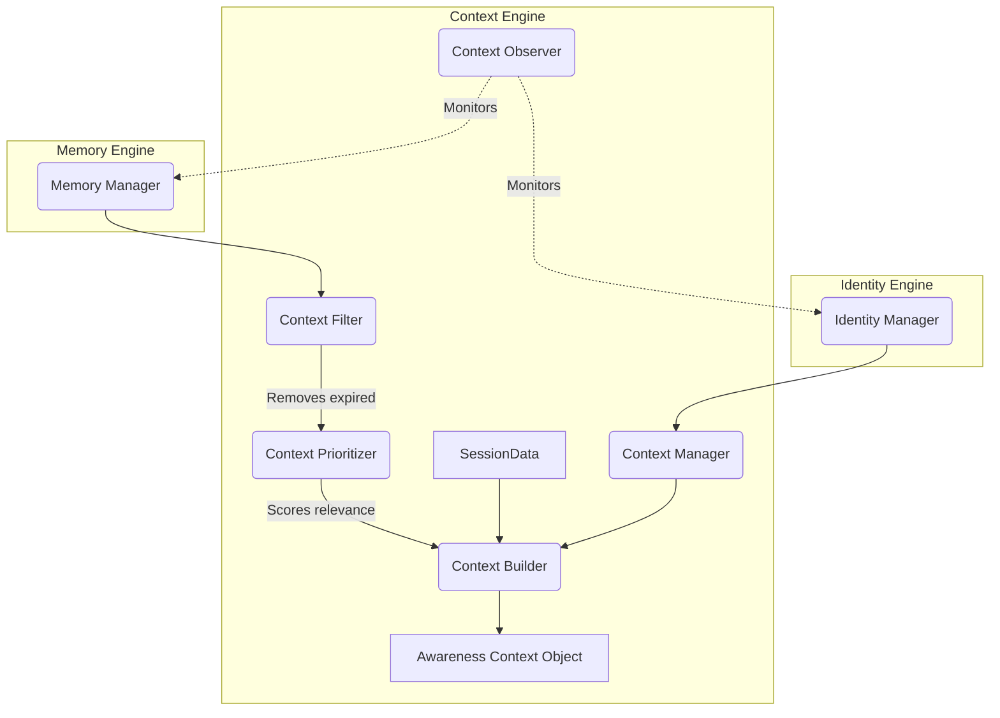

# Week 1 Part 3 - Context Engine Foundation

## Executive Summary
This sprint established the Context Engine, which acts as the awareness layer and nervous system for Jarvis OS. Rather than just responding to prompts, Jarvis now possesses the architecture to deduce "What is Boss doing?" and "What matters now?". The implementation uses strict rules-based heuristics for expiration, prioritization, and focus detection, avoiding AI overhead for basic awareness logic.

## Architecture

## Dependency Flow
1. The **Context Manager** depends on `IdentityManager` and `MemoryManager`.
2. The **Context Filter** receives raw memory lists and applies expiration logic based on string heuristics (`tomorrow`, `coding session`).
3. The **Context Prioritizer** takes the filtered list and sorts it by urgency keywords.
4. The **Context Builder** takes the final lists, alongside live `session_context`, runs `detect_current_focus()` against recent chat history, and emits the final aware state.

## Files Created
* `jarvis_os/context/context_manager.py`
* `jarvis_os/context/context_builder.py`
* `jarvis_os/context/context_prioritizer.py`
* `jarvis_os/context/context_filter.py`
* `jarvis_os/context/context_observer.py`
* `jarvis_os/context/README.md`
* `CONTEXT_ENGINE.md`
* `WEEK1_PART3_REPORT.md`

## Future Compatibility
The Context Engine sits perfectly above the Identity and Memory engines built in Part 2. It introduces a lightweight filtering pipeline that ensures the LLM's context window will never be overloaded with irrelevant or obsolete memory data. 

## Expansion Plan
In the next phase (Autonomous Agents / Planner), the `Awareness Context Object` generated by this engine will be the exact payload fed into the cyclic agentic loops. The `Context Observer` will be expanded to subscribe to a true event bus, allowing Jarvis to react to system events (like calendar alerts) without the user ever saying a word.
