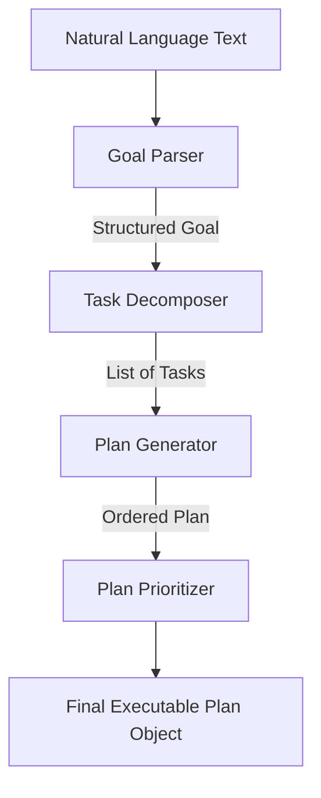

# Week 2 Part 1 - Planner Foundation Report

## Executive Summary
This sprint marked the beginning of Week 2 by building the Planner Foundation. The objective was to grant Jarvis the architectural capability to decompose large goals into smaller executable steps. Following the strict rules of this sprint, no existing APIs, FastApi behaviors, or frontend elements were touched, and no AI was utilized. The Planner uses deterministic rules to ensure system stability before introducing LLM variability.

## Files Created
* `jarvis_os/planner/planner_models.py`
* `jarvis_os/planner/goal_parser.py`
* `jarvis_os/planner/task_decomposer.py`
* `jarvis_os/planner/plan_generator.py`
* `jarvis_os/planner/plan_prioritizer.py`
* `jarvis_os/planner/planner_manager.py`
* `jarvis_os/planner/README.md`
* `PLANNER_ENGINE.md`
* `WEEK2_PART1_REPORT.md`

## Architecture & Data Flow

1. **Parser**: Strips polite prefixes ("please", "help me") and instantiates a `Goal`.
2. **Decomposer**: Analyzes the string. If it detects "internship", it returns 6 hardcoded tasks (Find, Analyze, Compare, Resume, Answers, Submit). If it detects "code", it returns 4 coding tasks.
3. **Generator**: Takes the array of tasks and strings them together linearly using the `dependencies` array.
4. **Prioritizer**: Looks for "urgent" or "tomorrow" and stamps the `Plan` and all its child `Task`s with the appropriate priority level.

## Future Compatibility
The use of Pydantic models in `planner_models.py` (`Goal`, `SubGoal`, `Task`, `Plan`) ensures that when we upgrade the Decomposer to use an LLM in the future, we can utilize strict JSON schema enforcement (e.g., OpenAI/Groq structured outputs) to guarantee the LLM returns exactly the format our `PlanGenerator` expects. 

This foundation sits entirely independent of the `Brain` and `Context` engines built in Week 1, adhering to the principles of a modular Operating System.
