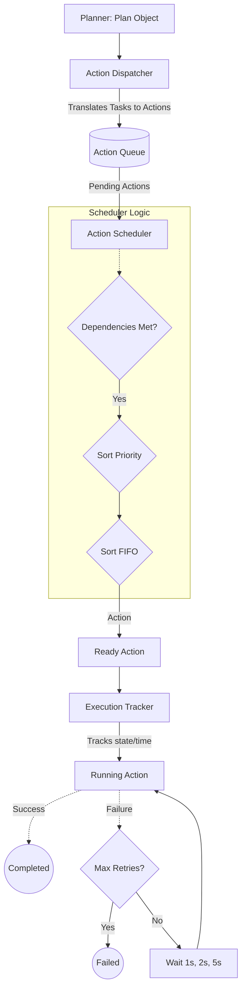

# Week 2 Part 2 - Executor Foundation Report

## Executive Summary
This sprint focused on building the Executor Foundation, the strict managerial organ that sits between the Planner and the physical hardware/API layer. The Executor is designed to safely handle the execution state of autonomous tasks. Adhering to the strict rules of this sprint, the Executor does **not** actually run anything yet. It prepares, queues, schedules, and tracks actions, ensuring that Jarvis will be able to handle complex, multi-step execution graphs safely in the future.

## Files Created
* `jarvis_os/executor/executor_models.py`
* `jarvis_os/executor/action_queue.py`
* `jarvis_os/executor/action_dispatcher.py`
* `jarvis_os/executor/action_scheduler.py`
* `jarvis_os/executor/execution_tracker.py`
* `jarvis_os/executor/executor_manager.py`
* `jarvis_os/executor/README.md`
* `EXECUTOR_ENGINE.md`
* `WEEK2_PART2_REPORT.md`

## Architecture & Data Flow

## Retry System
The `ExecutionTracker` implements a strict, generic retry logic to handle inevitable API or network failures. It is currently configured for a `MAX_RETRIES = 3` with an exponential-like backoff schedule of `[1, 2, 5]` seconds.

## Future Compatibility
By decoupling the *management* of execution from the *act* of execution, we ensure that Jarvis OS will not crash if a single sub-task fails. If an API times out during execution, the Tracker catches the error, increments the retry counter, waits according to the backoff schedule, and resubmits the action. If it completely fails, the Queue guarantees that dependent tasks will remain safely in the `pending` state rather than blindly executing out of order.
