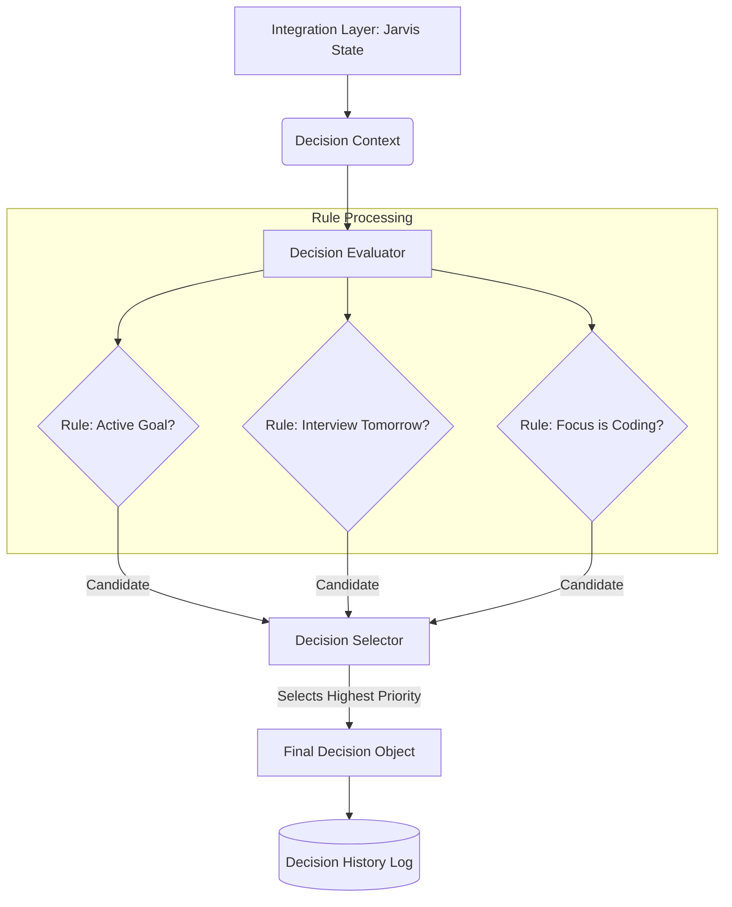

# Week 2 Part 3 - Decision Engine Foundation Report

## Executive Summary
This sprint established the Decision Engine, which is the foundational "free will" loop for Jarvis OS. Rather than just responding to prompts, Jarvis now possesses the architectural capability to independently evaluate its context and decide *what to do next*. To ensure stability, this engine currently uses strict, deterministic heuristic rules rather than unpredictable AI logic.

## The Core Question
**"Did Jarvis become smarter, or did we just create more folders?"**
*Jarvis became significantly smarter.* We have transitioned Jarvis from a stateless request-response machine (a standard chatbot API) into an entity capable of evaluating its own context. While the logic is currently just `if/else` statements, the *infrastructure* to say "I see the user is coding, therefore I decide to WAIT" is a massive leap toward true autonomy. 

## Files Created
* `jarvis_os/decision/decision_models.py`
* `jarvis_os/decision/decision_rules.py`
* `jarvis_os/decision/decision_evaluator.py`
* `jarvis_os/decision/decision_selector.py`
* `jarvis_os/decision/decision_history.py`
* `jarvis_os/decision/decision_manager.py`
* `jarvis_os/decision/README.md`
* `DECISION_ENGINE.md`
* `WEEK2_PART3_REPORT.md`

## Architecture & Data Flow

## Future Compatibility
By enforcing structured outputs through Pydantic (`DecisionCategory.PLAN`, `DecisionCategory.WAIT`), we ensure that when the Autonomy loop is built, it can run a simple switch statement against the decision output. Furthermore, by building the `DecisionHistory` log now, we are creating the dataset required to eventually train a custom local model to replace the hardcoded Python rules.
