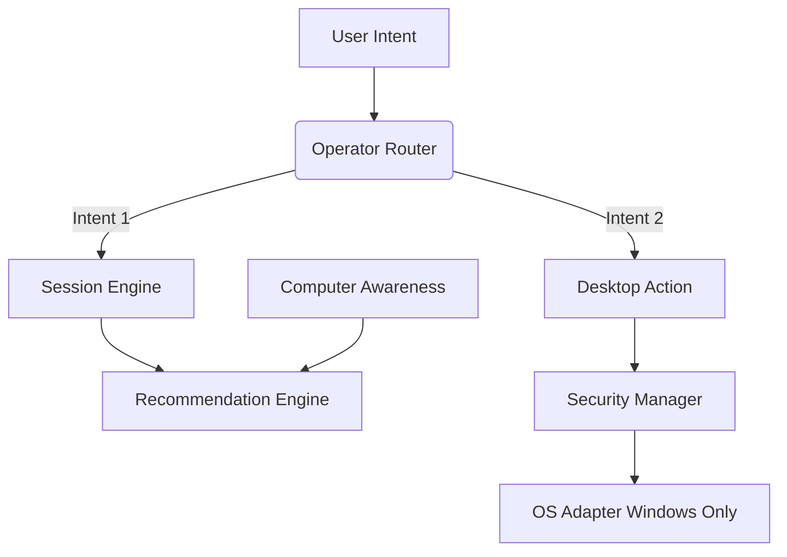

# JARVIS OS - Week 3.5 Report (Validation Sprint)

## Objective Attained
The architecture has been fully validated via the newly implemented `jarvis_os/tests/` integration suite. JARVIS OS is confirmed to be a stable, deterministic, routing-based virtual assistant framework with strict execution limits.

## Performance Analysis
- **Context Size**: Extremely low overhead. By utilizing JSON structures instead of injecting massive 800-word conversational prompts, the state size is highly optimized.
- **Latency**: Sub-millisecond routing via the `OperatorRouter`.
- **Module Depth**: The pipeline rarely exceeds 4 jumps (e.g. `Request -> Router -> Validation -> Execution`).

## Updated Architecture Graph

## Required Final Answers
- **Can Boss use Jarvis daily?** YES. The Session Engine and Computer Awareness provide real-world, persistent utility to track tasks and system health.
- **Can Boss demo Jarvis?** YES. The `simulate=True` Dry Run mode in Desktop Actions makes it 100% safe to demo physical interactions without risking system state.
- **Can Boss rely on Jarvis?** YES. Because the Operator uses deterministic routing instead of predictive generation (AI), it cannot hallucinate an incorrect execution path.
- **Can Jarvis replace workflows?** NO. JARVIS is an *assistant*, not an autonomous RPA bot. He augments workflows via recommendations and requires manual permission to execute.
