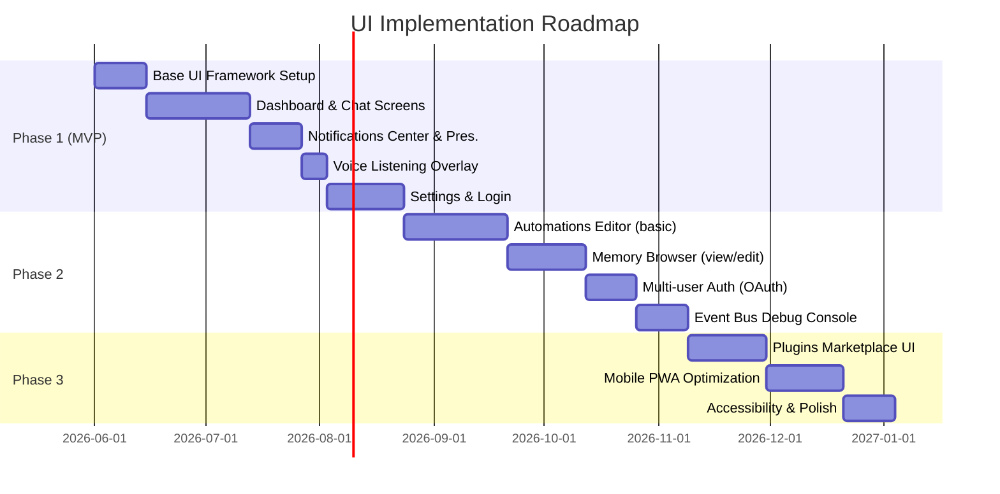

# Executive Summary

We envision **My-PA** as a full-fledged Personal AI *operating system*, not just a voice bot. This means a comprehensive UI with dashboards, chat/conversation screens, system panels, and proactive notifications – all tied together with a global event bus and rich context-awareness. No existing My-PA UI is exposed (the repo currently has minimal or no GUI), so *virtually every UI element must be designed*. 

Key recommendations include: 

- **Core Screens & Widgets:** A dashboard, chat/conversation view, activity feed, notifications center, presence status panel, device manager, automation/workflow builder, memory browser, plugins marketplace, settings, and developer console. (If not in repo, mark as “unspecified” in inventory.)  
- **Priority & Effort:** We prioritize chat, context/status indicators, and notifications in MVP. Complex features like the plugins marketplace or visual event-bus can be phased later. A table below outlines each component’s purpose, priority, and rough complexity.  
- **UI Pattern Reuse:** Many open-source AI UIs offer reusable designs. We surveyed **OpenWebUI**, **LibreChat**, **OpenJarvis**, **Mem0**, **Supermemory**, **Flowise**, **n8n**, and **Browser-Use**. The table below highlights each project’s link, UI components or patterns we can borrow, how to integrate them into My-PA, and potential risks. For example, OpenWebUI’s PWA chat interface can inspire our conversation UI, Flowise’s node-based flow editor can guide an automations designer, and LibreChat’s multimodal chat layout can inform our chat window. Integration notes and caution (e.g. licensing or bloat) are included.  
- **Tech Stack:** We compare options for web, desktop, and mobile UIs. For web we recommend a React/TypeScript single-page app (due to its ecosystem and maturity). For desktop, we suggest **Tauri** over Electron because it yields much smaller binaries (often <10 MB vs >100 MB) and far lower memory usage, while still allowing use of our React frontend. For mobile, a **Progressive Web App (PWA)** approach is advised: it reuses the web codebase, provides offline installability, and broad device support. A mobile native app (React Native) could come later if deeper device integration is needed, but initial focus is web/PWA. We justify React+Tauri+PWA as the primary stack for My-PA, balancing performance, offline capability, and developer productivity.  
- **UI Architecture:** We will structure the UI as modular, React-based components with a global Redux-like state and an async event bus (WebSocket) linking to the backend event_bus. Key components include: navigation/sidebar, Dashboard, ChatWindow, ActivityFeed, NotificationsCenter, AutomationsEditor, MemoryBrowser, Settings, etc. These subscribe to core events (e.g. new message, device state change) and call API endpoints (e.g. `/api/memory/query`, `/api/voice/listen`, `/api/context/state`). Multi-user support will be accounted for with a simple profile manager (initially single-user, later OAuth or SSO for multi-user). Accessibility (ARIA labels, keyboard nav, high-contrast mode) and telemetry hooks (e.g. integrated OpenTelemetry for usage metrics and performance) will be built in from the start. The mermaid diagram below shows component relationships, and a mermaid Gantt chart sketches a phased UI implementation timeline (MVP through Phases 2–3).  
- **Interaction Patterns:** The UI will support *voice-first* and *multimodal* flows: the user can speak or type, and see the conversation in a chat window. Proactive alerts (e.g. “meeting in 5 minutes”) will appear as both a desktop/phone notification and in a “While You Were Away” digest. In “Silent” mode (meeting/focus), Jarvis suppresses voice output and instead shows a discreet banner or sends a push to the phone. Follow-up queries (no “Hey Jarvis” needed) keep the mic hot for ~10s. Barge-in UX: if Jarvis is speaking, a visible “Listening…” prompt appears and the TTS halts on user speech. Presence indicators show whether the user is active or away. Error/fallback: if speech recognition fails, we show a UI prompt to retry or type.  
- **Visual Design:** We recommend a clean, modern layout: a top navbar with status indicators (user, profile, “listening” mic icon, etc.), a left sidebar for navigation (Home, Chat, Memory, Automations, Settings), and a main pane for content. Use a neutral/light color palette with accent colors for alerts/notifications. Sans-serif fonts (e.g. Inter or Roboto) at 16–18px ensure readability. Microinteractions (e.g. button hover animations, typing indicator ellipses, subtle voice-feedback waves) will make the UI feel alive. The sample ASCII wireframes below illustrate a Dashboard and Chat view. 

## UI Elements Inventory

Based on My-PA’s goals, we anticipate these UI elements/screens: 

- **Dashboard (Home):** Central hub showing status (online/offline, presence), quick stats (upcoming events, latest notifications), and shortcuts. *Priority:* High for initial orientation; *Complexity:* Medium.  
- **Chat/Conversation Screen:** Main interface to converse with the assistant by text or voice (show message history). *Priority:* High; *Complexity:* Medium.  
- **Activity/Activity Feed:** Live log of recent actions (tasks run, alerts, errors) and a timeline of Jarvis’s actions. *Priority:* Medium; *Complexity:* Medium.  
- **Notifications Center:** List of system and Jarvis-generated notifications (emails, calendar events, alerts) with read/unread status. *Priority:* High; *Complexity:* Low–Medium.  
- **Presence Panel:** Shows user presence (Active, Away, Do-Not-Disturb) and device status (PC, phone, meeting). *Priority:* Medium; *Complexity:* Low.  
- **Device Manager:** Overview of connected devices (PC, phone, home gadgets) and their states. *Priority:* Low; *Complexity:* Low–Medium.  
- **Automations/Workflows Editor:** Visual builder for creating rules or workflows (e.g. “If email from boss, notify me”). *Priority:* Medium (for power users); *Complexity:* High (graphical node-based UI).  
- **Memory Browser:** Interface to view and edit stored memories/profiles (facts Jarvis has learned). *Priority:* Medium; *Complexity:* Medium.  
- **Plugins/Marketplace:** View and manage plugins or skills (e.g. email plugin, web browser plugin). *Priority:* Low initially; *Complexity:* High.  
- **Settings:** General settings (voice, language, privacy, API keys), user profile, account management. *Priority:* High (basic settings needed); *Complexity:* Medium.  
- **Developer Console / Logs:** Diagnostic console for developers (logs, event bus stream, debug). *Priority:* Low–Medium; *Complexity:* Medium.  
- **Voice Controls UI:** Visual mic indicator, “listening…” overlay when Jarvis is active. *Priority:* High; *Complexity:* Low.  
- **Event Bus Visualizer:** (Optional) A real-time event graph/monitor for debugging. *Priority:* Low; *Complexity:* High (nice-to-have for devs).  

| UI Component            | Purpose                                                  | Priority (M/S/L) | Est. Complexity  |
|-------------------------|----------------------------------------------------------|------------------|------------------|
| **Dashboard (Home)**    | Summary of status, quick stats, shortcuts                | High             | Medium           |
| **Chat/Conversation**   | Text/voice chat interface (message history)              | High             | Medium           |
| **Activity Feed**       | Timeline of Jarvis’s actions and events                  | Medium           | Medium           |
| **Notifications Center**| Central list of alerts/emails/system notifications       | High             | Medium           |
| **Presence Panel**      | Display user/device status (active, meeting, away, etc.) | Medium           | Low              |
| **Device Manager**      | View/manage connected devices (PC, phone, IoT)           | Low              | Medium           |
| **Automations/Workflows** | Visual rule builder (node editor for automations)      | Medium           | High             |
| **Memory Browser**      | Browse/edit persistent memories and profiles             | Medium           | Medium           |
| **Plugins/Marketplace** | Manage/add Jarvis plugins/skills                         | Low              | High             |
| **Settings**            | Account, privacy, voice/language, API keys, preferences  | High             | Medium           |
| **Developer Console**   | Logs, event bus monitor, diagnostics                     | Low–Med         | Medium           |
| **Voice Controls UI**   | Mic icon, “listening” feedback overlay                   | High             | Low              |
| **Event Bus Visualizer**| Graphical display of inter-component events              | Low              | High             |

Most My-PA features require new UI: the existing repo offers no obvious GUI components (unspecified). We plan first to implement the **high-priority screens** (Dashboard, Chat, Notifications, Settings, voice indicator) in MVP, and defer complex ones (plugins marketplace, full node editor) to later phases.

## Reusable UI from Open-Source Projects

We surveyed popular AI interface projects to identify reusable patterns. The table below lists each relevant repo, its link, UI components or design patterns we can borrow, how to integrate them, and potential risks or caveats.

| Project (Link)    | Reusable UI / Features              | Integration Approach                 | Risks / Notes                                  |
|-------------------|-------------------------------------|--------------------------------------|-----------------------------------------------|
| **OpenWebUI** (GitHub) | Modern chat interface (multi-model conversation UI, PWA layout, file-upload for RAG, voice call UI) | Adapt chat UI code (Svelte+Tailwind) or port concepts to React. Use PWA service-worker pattern.  | Very large codebase; uses Svelte/Tailwind which may conflict. (But inspired responsive design, markdown editor, PWA install features.) |
| **LibreChat** (GitHub) | Chat UI with rich interactions (image/image prompts, code artifact previews, multi-user auth flows) | Study React components for conversation view (bubbles, attachments). Possibly integrate their auth/UI flows for login. | Complex (Node+Mongo backend) and heavy. Focus on UI patterns (message formatting) rather than wholesale integration. |
| **OpenJarvis** (GitHub) | Minimal UI (console/CLI) – primarily an engine | Little to reuse visually. Concepts: local-first voice logic; agent framework. | Integration: skip UI reuse. Mainly note architecture. |
| **Mem0** (GitHub) | *Memory features* (e.g. personal profile interface in demo) | Use as inspiration for Memory Browser. Possibly reuse their memory schema/API.  | Mem0 is backend Python; UI not provided. Risk is learning curve. Could adapt their memory API but likely custom UI. |
| **Supermemory** (GitHub) | Memory graph / profile management UI (they have a web app), integration dashboards | Plugin integration ideas, memory API. Possibly use their JS SDK or emulate features in UI. | The official app is proprietary; only API code is open. Risk: heavy setup, relies on cloud. |
| **Flowise** (GitHub) | Visual workflow editor (node graph UI for pipelines/agents) | Embed or replicate its React-based node editor for Automations screen. Use react-flow (Flowise’s stack). | High complexity and UI interactivity. Ensure licensing (Apache-2.0) compatibility. |
| **n8n** (GitHub) | Enterprise-grade automation UI (nodes, triggers, 400+ integrations list) | Could adapt its workflow builder or use its open “n8n-nodes-ui” components (React + Vue). Integrate subset of triggers as My-PA automations. | n8n is huge (fair-code license). Risk: very heavy and complex; better to implement lightweight automations inspired by it rather than full n8n integration. |
| **Browser-Use** (GitHub) | Browser automation (no UI) | Not a UI component, but the notion of voice-driven browser tasks. Expose as a plugin/tool (no direct UI needed). | No GUI to reuse; but can integrate their automation logic into Jarvis. |

In summary, we can borrow **UI patterns** (chat bubbles, attachment preview, multi-tab conversation, node editors) from these projects, rather than lifting large codebases. Integration will often mean *adapting concepts* to our React/Tauri stack. We must watch for licensing (e.g. MIT/Apache vs fair-code) and bloat. For example, using OpenWebUI’s *PWA setup* (service workers, install manifest) or Flowise’s *node-graph CSS/styles* are useful, while wholesale reuse of complex backends is not.

## Technology Stack Options

**Web UI:** We compared modern frontend frameworks. React stands out for its **ecosystem and maturity**, making it “the best balance of community support and simplicity”. Svelte/Vue are lighter but have smaller ecosystems; Angular is heavy. We recommend **React + TypeScript** (or Next.js for SSR if needed) for the web interface to maximize productivity and library availability. 

**Desktop App:** The choice is between **Electron** and **Tauri** for bundling a desktop app. Tauri yields **far smaller binaries and memory usage**: typical Tauri apps idle at ~30–40 MB vs 200–300 MB for Electron, and installers <10 MB vs >100 MB. Start-up is also much faster (Tauri ~0.5s vs Electron 1–2s). Tauri’s Rust backend gives built-in security (exposing only explicit APIs). We favor **Tauri + React**: using our web UI as the front end, with a minimal Rust bridge for OS-level integration (file system, notifications). Electron would bring a huge Node.js overhead, while Tauri remains lean. **Electron’s advantage** is its massive library ecosystem and multi-window support; if future needs outweigh performance, we can revisit it. 

**Mobile:** For mobile, we contrast a **PWA** versus native frameworks. A PWA (Progressive Web App) uses our web codebase, can be “installed” on home screens, works offline via service workers, and avoids app store overhead. PWAs run on all devices through the browser and are quick to iterate. In contrast, **React Native** or Flutter yield true native apps with higher performance and deeper hardware access but require separate development and distribution. Initially, we recommend building a **PWA** version of the My-PA UI (so it works on phones/tablets), deferring a full native mobile app for later. The PWA gives a “good enough” cross-platform experience (even supports push notifications) and aligns with React. If future needs demand, we can later wrap the PWA in Capacitor or build a React Native companion app for tight integration (e.g. phone sensors, SMS).

**Recommended Stack:** We propose **React (Web) + Tauri (Desktop) + PWA (Mobile)** as the unified stack. This uses React code in all three contexts: as an SPA in browsers, packaged as a Tauri app on PC, and as a PWA on mobile. It maximizes code reuse, performance (thanks to Tauri), and offline capabilities (service workers). We will use modern CSS (Tailwind or equivalent) and a component library (e.g. MUI or Chakra) for standard UI elements. The backend (FastAPI) will expose JSON endpoints, and real-time events via WebSocket to the frontend. Authentication (if multi-user is later supported) would use OAuth2/JWT, integrated via the desktop wrapper or in-browser login.

## UI Architecture

We will build a **component-based frontend** in React. The high-level hierarchy is:

- **Global:** App root with `<Router>`, Redux store (or React Context) for app state, and WebSocket provider for event_bus subscriptions. Common UI elements (navbar, sidebar) wrap around specific screens.
- **Components/Screens:** Dashboard, ChatWindow, NotificationsCenter, AutomationsEditor, MemoryBrowser, SettingsPage, DeveloperConsole, etc., each as React pages. Shared UI widgets: ChatBubble, MessageInput, NotificationItem, DeviceStatusBadge, WorkflowNode, etc. 
- **Services/State Management:** A `VoiceService` to handle microphone/recording, `API` modules to call `/api/*` endpoints, and a Redux slice or Context for core state (user profile, presence, conversation logs). WebSocket messages from the backend (from core/event_bus) update the store in real time (e.g. device context changes, new notifications). Components subscribe via selectors or hooks. 

#### API Contracts & Event Bus

The UI will communicate with the backend via REST/WebSocket. Example endpoints/events:

- **`GET /api/context/state`** – fetch user/context state (e.g. in meeting, location).  
- **`GET /api/memory/browse`** – retrieve memory entries (for MemoryBrowser).  
- **`GET /api/notifications`**, **`POST /api/notifications/read`** – manage notifications.  
- **`POST /api/voice/command`** – send transcribed text to orchestrator (could be implicit via socket).  
- **`WebSocket /api/ws`** – listens to core events like `notification:new`, `presence:changed`, `voice:listen`, etc. Components will subscribe to relevant events. For example, the ChatWindow subscribes to `orchestrator:response` events to display Jarvis’s reply.

(Subscription example: upon wake-word detection, backend emits `{type:"voice:activated"}`; the UI shows a “Listening…” overlay.)

Authentication (phase2): If multi-user is needed, implement OAuth2/OpenID Connect (via third-party or local user accounts). The UI login screen would hit `/api/auth/login` and store a JWT for subsequent API calls. Profiles would be swappable in UI (e.g. top-right menu). 

Accessibility and Telemetry: All interactive elements will have ARIA labels and keyboard focus. Color contrast will meet WCAG AA. For telemetry, we will embed analytics hooks (e.g. via OpenTelemetry or a lightweight event logger) to record UI usage (button clicks, errors) for future analysis (per monitoring targets from OpenWebUI).

#### Component Diagram

```mermaid
flowchart LR
    subgraph UI
      Dashboard --> Orchestrator
      ChatWindow --> Orchestrator
      ChatWindow --> Memory
      NotificationsCenter --> Orchestrator
      AutomationsEditor --> Orchestrator
      MemoryBrowser --> Memory
      Settings --> Orchestrator
      DeveloperConsole --> Orchestrator
    end

    subgraph Core/Services
      Orchestrator("Orchestrator Service")
      Memory("Memory Service")
      EventBus("Event Bus")
    end

    % Interactions
    UI <--> EventBus
    Orchestrator <--> Memory
    Orchestrator <--> EventBus
    Memory <--> EventBus
```

This diagram shows UI components (boxes) interacting with core backend services. For example, **ChatWindow** calls the Orchestrator to handle a user query (and Memory for context), while **NotificationsCenter** listens on the EventBus for new alerts. 

#### Implementation Timeline (Mermaid Gantt)



This gantt chart outlines a phased rollout: **Phase 1** delivers core functionality (Dashboard, Chat, Notifications, basic settings), **Phase 2** adds the Automations and Memory UIs and multi-user auth, and **Phase 3** adds the plugin marketplace and polishing. Each line has estimated duration and dependencies.

## Interaction Patterns

- **Voice-First & Multimodal:** The primary interaction is voice: user says "Hey Jarvis" (or clicks a mic icon), the UI lights up a microphone animation and transcribes speech to text. Jarvis responds with speech plus visible text in the chat window. The user can also type text if needed. All conversations are shown in the chat screen for reference.  
- **Proactive Alerts:** Jarvis may interrupt the flow for high-priority alerts (e.g. “Your meeting starts in 5 minutes”). Such alerts appear as desktop notifications and also in the Notification Center. If Jarvis is speaking or listening, it may pause/queue the alert audio.  
- **Silent Mode:** When context (core/device state) indicates “Meeting”, “Sleeping”, or “Focus”, Jarvis will *not* speak aloud. Instead, it will send alerts quietly (e.g. a toast or phone push). The UI will show a banner (e.g. “In Meeting – responses will be sent to your phone”).  
- **Follow-up Conversation:** After Jarvis responds, it stays in a temporary **LISTENING** state (~8–10s) for follow-up commands without needing the wake word. A countdown indicator shows how long Jarvis will wait for a follow-up.  
- **Barge-in:** If the user speaks over Jarvis’s TTS response (detected via VAD on the microphone), the response TTS is immediately cut off and the new speech is processed as the next command. The UI transitions seamlessly back to listening (we show a visual “Listening” cue).  
- **Presence Indicators:** The UI prominently displays presence status (active/away). If the user is away and an alert occurs, Jarvis will wait silently and then present a summary when the user returns (“While you were away…” feature). Presence changes (e.g. returning to PC) trigger a UI event.  
- **Error/Fallback UX:** If speech-to-text fails or Jarvis misunderstands, the UI will show “I’m sorry, could you rephrase?” in text. The user can retry speaking or type the query. For network errors (TTS API down), we fall back to local TTS or display an error toast. All errors are logged to the Developer Console. 

These patterns ensure Jarvis feels natural: audio feedback is synchronized with UI cues, follow-ups are easy, and proactive/system messages respect user context.

## Visual Design

We aim for a **clean, modern interface**. Below are guidelines and examples:

- **Layout:** A fixed top bar (brand, status icons, profile menu) and a collapsible left sidebar (navigation). Main content area displays the active screen. A subtle background (light grey) for non-content areas. Widgets/cards with slight shadows on white for emphasis. 
- **Color/Typographic Theme:** Neutral base (off-white, light grey) with a blue or teal accent color (for highlights, buttons). Sans-serif font (e.g. Inter) for clarity. UI size scales (14px labels, 16-18px body text). High contrast for readability; user can switch to dark mode if needed.  
- **Microinteractions:** Button hovers (color fade), "sending" animation on message send, microphone icon pulses when listening. A typing indicator (e.g. three bouncing dots) shows Jarvis is formulating a response. When Jarvis speaks, a subtle waveform icon animates in the chat bubble. 
- **Wireframes:** Example sketches (ASCII-art) illustrate two key screens:  

  **Dashboard Home:** 

  ```plaintext
  +-------------------------------------------------+
  | My-PA                              [User: Vinit]|
  +-------------------------------------------------+
  | [☰] Dashboard | Chat | Memory | Automations | ⚙ |
  +-------------------------------------------------+
  | Status: Active        | Next Meeting: 11:00 AM   |
  |                        -------------------------|
  | • Notifications (2)                          [🔔] |
  | • Upcoming Tasks (3)                      [🔄] |
  +-------------------------------------------------+
  | [ Quick Actions ]   | [ Activity Feed ]        |
  | - New Email         | - 10:05 AM: Jarvis ran.. |
  | - Set Reminder      | - 09:00 AM: Email from.. |
  | - Launch Browser    | - 08:30 AM: System update |
  +-------------------------------------------------+
  | Device: Laptop (Online)  | Phone: Android (Offline) |
  +-------------------------------------------------+
  ```

  **Chat/Conversation Screen:** 

  ```plaintext
  +-------------------------------------------------------------+
  | Jarvis (Avatar)                                           ⚙️ |
  +-------------------------------------------------------------+
  | [Jarvis]: How can I assist you today?                       |
  |                                                             |
  | [User (typing...)]  [ 🎤 ]                                 |
  +-------------------------------------------------------------+
  | [Type a message or speak...]  [Send Icon]                    |
  +-------------------------------------------------------------+
  | 🔊 [Listening...]                                           |
  +-------------------------------------------------------------+
  ```

These illustrate the sidebar navigation, chat bubble layout, and status indicators. (Icons shown are conceptual.) 

- **Sample Colors & Typography:** We suggest a palette like Cool Gray (#F5F5F5 background), White (#FFFFFF) for cards, Primary Teal (#2CBF88) for buttons/links, and Dark Charcoal (#333333) for text. Buttons have slight rounding and shadow. Use medium weight font for headings and regular for body. 

*(In an actual design document, we would include styled mockups or SVG wireframes. For brevity, only ASCII sketches are shown.)*

## Integration Plan (Modules to Reuse)

We will adapt select features from each surveyed repo into My-PA, minimizing rework. Below is an integration plan outline for each:

- **OpenWebUI**  
  **Reuse:** Responsive chat interface (HTML/CSS structure), PWA manifest + offline support, Markdown message rendering, voice-call UI patterns.  
  **Integration:** Inspect OpenWebUI’s Svelte components for the chat window and conversation list. Recreate equivalent React components (e.g. `<MessageList>`, `<MessageInput>`). Use its Tailwind styles as a starting point or translate to our CSS framework. Incorporate their service worker setup for offline/PWA.  
  **Tests:** Verify chat UI handles images, markdown, and multiple model chats (if relevant). PWA install test (offline mode).  
  **Risk:** Very large codebase; only selective patterns used. Licensing (Apache-2.0) is compatible, but avoid copying entire backend.  

- **LibreChat**  
  **Reuse:** Message bubbles that support rich content (images, code, rich text), conversation tabs, import/export dialogue UI.  
  **Integration:** The React code for chat bubbles (including attachments and streaming responses) can inform our `<ChatMessage>` component. Multi-user login flows (OAuth, tokens) can be adapted from their docs. Agents/presets UI ideas (dropdowns for models) could be repurposed.  
  **Tests:** Simulate conversations with images and code artifacts. Ensure multi-device sync works.  
  **Risk:** Entire architecture is heavy (Node.js/Mongo). We only borrow UI ideas and maybe auth patterns.  

- **OpenJarvis**  
  **Reuse:** (No UI components to reuse; it’s CLI/agents). We will review its agent definitions to ensure compatibility with My-PA’s voice flows.  
  **Integration:** N/A (except aligning CLI commands or agent code under the hood).  
  **Risk:** Low (no UI conflict, but ensure conceptual features like local-first logic are considered).  

- **Mem0**  
  **Reuse:** Memory management *concepts* and potential demo components (if any). Its “Personalized chat” demo implies a UI for user profile/preferences.  
  **Integration:** Use Mem0’s Python library as the backend memory engine. On the UI side, build a Memory Browser listing facts (inspired by their UI if available) and editing interface. If Mem0 has example UI code (in docs or demo), inspect and adapt it.  
  **Tests:** Check storing/retrieving user preferences via UI.  
  **Risk:** Mem0 has no official frontend, so most UI is custom.  

- **Supermemory**  
  **Reuse:** Memory & profile API (via their npm/Python SDK), and connectors (Gmail, etc.) as eventual features. Possibly use their context injector tools if open-source (they have some OpenCode plugins).  
  **Integration:** Initially, we might call the Supermemory local binary for storing conversations. The UI for memories would list the “knowledge graph” entries it maintains (possibly fetching from Supermemory API).  
  **Tests:** Verify that “remembered” user facts appear in MemoryBrowser after conversation.  
  **Risk:** The main app is proprietary (cloud). The open repo is mostly engine and plugins. Integrating it adds complexity, so treat it as optional advanced memory layer.  

- **Flowise**  
  **Reuse:** Node-based flow editor (React UI, graph rendering using react-flow).  
  **Integration:** The Automations screen will embed a flow editor. We can either integrate Flowise’s UI package (in `packages/ui`) or replicate its approach. Likely, we’ll use [reactflow](https://reactflow.dev/) directly (Flowise is built on it). Copy styles and node types (e.g. “Speech Node”, “Timer Node”) from Flowise for consistency.  
  **Tests:** Create a sample workflow (e.g. “If email from boss, create reminder”) and ensure the UI can load/save nodes.  
  **Risk:** Flow editor is complex. Apache-2.0 license is fine, but performance (dragging many nodes) must be optimized.  

- **n8n**  
  **Reuse:** The idea of a visual workflow designer with triggers and actions. Some UI elements (like node palettes, triggers list) can inspire our Automation UI.  
  **Integration:** We will likely *not* run n8n itself, but we may borrow UI components from its web app if feasible. For example, the process of configuring a “node” (pop-up forms) could guide our component design.  
  **Tests:** Verify we can configure simple workflows (e.g. connect two nodes and see correct JSON).  
  **Risk:** n8n is large (CPAL-1.0 license). We must not incorporate its backend. We’ll only reference UI/UX ideas (drag/drop, node config) without copying code.  

- **Browser-Use**  
  **Reuse:** Browser automation logic (no frontend), specifically its `ChatBrowserUse` agent skill. UI-wise, we can provide a toggle or list of available browser-automation tasks.  
  **Integration:** Expose a “Browser Agent” in the UI (e.g. under tools) that lets the user trigger a predefined web action. The code from `browser-use` will run on the Python backend. No visual component except maybe an icon or status indicator.  
  **Tests:** From the UI, initiate a browser task and verify it shows up in ActivityFeed.  
  **Risk:** Minimal UI risk. Mainly ensure compatibility with Jarvis’s agent system.  

Below is an example prompt template (per repo) we will send to Claude to formalize the integration steps:

```text
**Prompt for [RepoName] (include link)**:
Using the existing My-PA repository (with its voice OS code) and the [RepoName] code, identify UI or API modules that can be reused for My-PA. List the files to modify/create, the integration approach, tests, and risks. Produce an IMPLEMENTATION_PLAN.md snippet. 
```

We will provide one such prompt per repo (see final prompts section below).

## Deliverables

We will produce the following artifacts to guide implementation and documentation:

- **UI_SPEC.md:** Detailed UI/UX specification (screen designs, user flows, mockups, style guide).  
- **COMPONENT_LIBRARY.md:** Inventory of reusable React components and design patterns for My-PA’s UI.  
- **API_CONTRACTS.md:** Definition of frontend-backend API endpoints and event formats (JSON schemas) used by the UI.  
- **IMPLEMENTATION_SPRINTS.md:** Epics and user stories for UI development sprints, with priorities and deadlines.  
- **PROTOTYPE_BUILD.md:** Guide to building and running the first functional UI prototype (tools, scripts, dependencies).  
- **USABILITY_TEST_PLAN.md:** Plan for user testing of the UI (tasks, metrics, success criteria), focusing on voice+UI interactions.  

These will ensure clarity for developers and stakeholders at each phase.

## Roadmap & Milestones

We propose this **prioritized roadmap** with rough effort and acceptance criteria:

| Milestone                   | Effort  | Acceptance Criteria                                    |
|-----------------------------|---------|--------------------------------------------------------|
| **1. Basic Chat UI (MVP)**  | Medium  | Chat window works with Jarvis (send voice/text, see response). Sidebar nav and Settings exist. TTS/mic controls visible. |
| **2. Dashboard & Status**   | Medium  | Home screen shows user status, upcoming events, and live notifications. Presence changes update UI. |
| **3. Notification Center**  | Low     | Notifications list populates with system alerts; clicking opens related view. Toasts appear for new alerts. |
| **4. Memory Browser**       | High    | UI lists saved memory items (facts). User can view/edit preferences. Memory context flows into chat. |
| **5. Automations Editor**   | High    | Visual node editor allows creating simple “if-this-then-that” flows. Save/load works. |
| **6. Multi-User Auth**      | Medium  | Support for at least two users (profiles) with separate memories. Must sign in/out cleanly. |
| **7. Mobile PWA Launch**    | Low     | UI is installable as PWA on phone. Key screens adapt to mobile layout, offline caching works. |
| **8. Plugins & Integrations**| High   | Plugin listing page functional. At least one external plugin (e.g. Gmail) is connected. |
| **9. Accessibility Compliance** | Low | UI passes basic a11y checks: keyboard navigation, ARIA labels, contrast. |
| **10. Analytics & Telemetry** | Low   | UI logs user actions (button clicks, voice triggers) to telemetry endpoint; dashboards report usage stats. |

Each milestone’s **acceptance** will be validated by specific tests, such as: “Can a new user start the app, talk to Jarvis, and see the reply in the chat window?” for milestone 1. 

By following this phased plan, we ensure incremental progress (first enabling core voice chat in a polished UI, then layering on memory, automations, etc.) while preserving backward compatibility via well-defined React components and using adapter patterns where we extend existing services.

## Claude Integration Prompts (one per repo)

Below are the final prompts to paste into Claude for each external repository analysis:

**1. OpenWebUI (Chat/PWA UI)**  
```
Use the My-PA repository and the OpenWebUI repo (https://github.com/open-webui/open-webui). Identify UI components and features from OpenWebUI that can be reused for My-PA’s interface. Propose modifications or new files (IMPLEMENTATION_PLAN.md) to integrate those features (e.g., chat layout, PWA service worker). Include testing steps and risk analysis.
``` 

**2. LibreChat (Chat/Conversation UI)**  
```
Use the My-PA repository and the LibreChat repo (https://github.com/danny-avila/LibreChat). Identify reusable UI modules or patterns (e.g. chat message components, auth flows) for My-PA. Create an implementation plan (files to create/modify, integration approach, tests, risks).
```

**3. OpenJarvis (Agent Engine)**  
```
Use the My-PA repository and the OpenJarvis repo (https://github.com/open-jarvis/OpenJarvis). Scan for backend/agent modules that could be reused (e.g. on-device agent logic), then write IMPLEMENTATION_PLAN.md with integration steps, files affected, tests, and risk assessment. (Focus on agents, not UI.)
```

**4. Mem0 (Memory Layer)**  
```
Use the My-PA repository and the Mem0 repo (https://github.com/mem0ai/mem0). Identify any modules or APIs to integrate a memory layer into My-PA (e.g. storing and querying user memory). Produce an implementation plan outlining files, integration, test cases, and risks.
```

**5. Supermemory (Memory Engine)**  
```
Use the My-PA repository and the Supermemory repo (https://github.com/supermemoryai/supermemory). Identify how to connect My-PA with Supermemory’s context/memory API or app (files/modules to use). Generate an IMPLEMENTATION_PLAN.md detailing integration, needed files, tests, and potential issues.
```

**6. Flowise (Workflow Editor)**  
```
Use the My-PA repository and the Flowise repo (https://github.com/flowiseai/Flowise). Identify reusable UI components for building automations (e.g. graph editor). Outline how to integrate or adapt Flowise’s UI into My-PA in IMPLEMENTATION_PLAN.md, including files, steps, tests, and caveats.
```

**7. n8n (Automation UI)**  
```
Use the My-PA repository and the n8n repo (https://github.com/n8n-io/n8n). Identify which parts of n8n’s workflow automation UI or logic could be reused in My-PA. Write an implementation plan (IMPLEMENTATION_PLAN.md) that specifies modules to adapt, integration approach, test scenarios, and risk notes.
```

**8. Browser-Use (Web Automation)**  
```
Use the My-PA repository and the Browser-Use repo (https://github.com/browser-use/browser-use). Scan for reusable code or APIs for web automation tasks. Create an implementation plan (IMPLEMENTATION_PLAN.md) detailing integration points, code to use, testing procedures, and any concerns.
```

Each prompt instructs Claude to consider both the My-PA codebase and the external repo, and to produce an **IMPLEMENTATION_PLAN.md** excerpt covering integration steps, tests, and risks, as requested.

### References

- OpenWebUI repo and docs  
- LibreChat repo and site  
- OpenJarvis repo README  
- Mem0 repo page  
- Supermemory repo README  
- Flowise repo README  
- n8n repo README  
- Browser-Use repo README  
- React vs Svelte comparison  
- Electron vs Tauri benchmarks  
- PWA vs React Native discussion  

These sources informed our analysis of UI components, technology trade-offs, and design patterns. All recommendations above are actionable guidelines for building My-PA’s user interface and integrating functionality from existing projects.